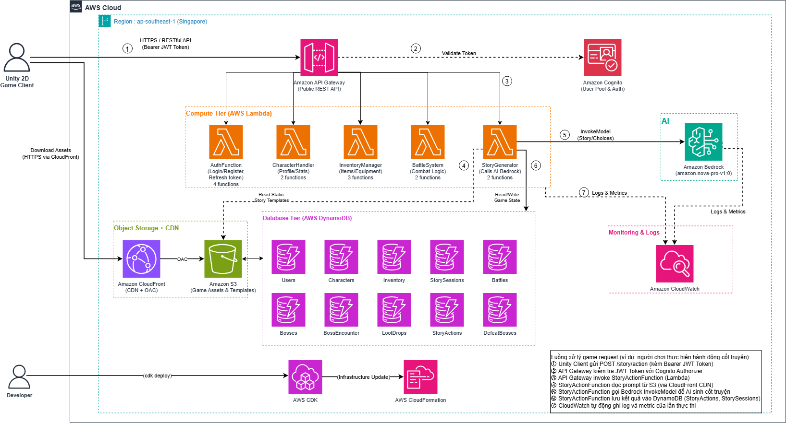

# Project Proposal: AI Dungeon RPG Adventure

## 1. Project Overview
The **AI Dungeon RPG Adventure** introduces a revolutionary approach to the 2D Role-Playing Game genre. By combining the vast potential of Generative AI with the robustness of AWS Serverless computing, this project delivers an experience that genuinely evolves with the player.

Players are empowered to create their own avatars and dive into uncharted journeys where storylines, environmental obstacles, and turn-based Boss fights are dynamically generated via **AWS Bedrock**. The entire visual experience is seamlessly rendered on a **Unity 2D Client**, which communicates with a powerful, event-driven **.NET 8 Backend** hosted securely on AWS.

## 2. Challenges and Proposed Solutions

### Limitations of Current RPGs
*   **Predictable and Static Content:** Most RPGs rely on pre-written, branching dialogues. No matter how expansive the game is, players will eventually exhaust the content, leading to a repetitive and predictable experience.
*   **High Infrastructure Costs:** Maintaining traditional stateful game servers requires a massive budget for idle resources, and they often struggle to scale seamlessly during unpredictable traffic spikes.

### Our Innovative Approach
*   **Endless AI-Generated Narrative:** By utilizing Large Language Models (LLMs) through **AWS Bedrock**, the game constantly spins up fresh scenarios, environments, and outcomes in response to the player’s unique actions.
*   **Serverless Cost-Efficiency:** Essential game mechanics—such as user authentication, inventory tracking, and combat resolution—are offloaded to **AWS Lambda** and **Amazon DynamoDB**. This ensures the game scales automatically to meet demand while strictly adhering to a cost-effective Pay-as-you-go model.

## 3. Architecture Overview

This project relies entirely on an AWS Serverless architecture, maintaining a strict boundary between the Game Client and the Backend to optimize both security and responsiveness.

*(High-Level Architecture Diagram)*

*   **Amazon API Gateway & Cognito:** Acts as the secure front door, managing user registrations, logins, and JWT Token validation for all incoming API calls.
*   **Processing Tier (AWS Lambda - .NET 8):** Contains distributed functions that execute critical game logic, including character state updates, turn-based battle mechanics, inventory changes, and interfacing with AI services.
*   **Storage Tier (Amazon DynamoDB):** A high-speed NoSQL database that stores the game’s configurations, item databases, and live player sessions with ultra-low latency.
*   **AWS Bedrock:** The imaginative engine of the game, taking contextual prompts and generating interactive story events on the fly.

## 4. Technology Stack & Implementation

The development follows a **Monorepo** strategy, allowing the C# Unity Client and the C# Lambda Backend to seamlessly share Domain Models and Data Transfer Objects (DTOs).
*   **Client Application:** Built in Unity (C#) using the 2D Universal Render Pipeline (URP), ensuring crisp visuals while fetching data via RESTful APIs.
*   **Infrastructure as Code (IaC):** The complete AWS setup is scripted using the **AWS CDK (C#)**. This guarantees that deployments across various environments (Development, Production) are fast, consistent, and easily reproducible.
*   **Security Model:** Adopts a Server-Authoritative approach. To prevent client-side manipulation, all vital calculations (such as health deductions, damage dealt, and item acquisition) are securely executed on AWS Lambda.

## 5. Development Roadmap

*   **Phase 1 (22/06/2026 - 05/07/2026):** Lock in the overall architecture, set up the AWS CDK project, and successfully roll out Amazon Cognito and the DynamoDB tables.
*   **Phase 2 (06/07/2026 - 19/07/2026):** Integrate AWS Bedrock. Construct intelligent `Prompt Builders` to feed context to the AI, and implement a JSON `Response Parser` to decode AI outputs into playable game logic.
*   **Phase 3 (20/07/2026 - 02/08/2026):** Finalize the backend functionalities, specifically focusing on the Turn-based Combat system, Boss spawning logic, and Inventory management.
*   **Phase 4 (03/08/2026 - 15/08/2026):** Connect the Unity Client to the Backend APIs. Perform rigorous End-to-End (E2E) testing and fine-tune the AI response times.

## 6. Budget & Cost Analysis

One of the most compelling aspects of this Serverless design is the ability to maximize the AWS Free Tier, keeping development costs incredibly low:
*   **AWS Cognito / Lambda / DynamoDB:** $0.00 (Easily stays within free tier thresholds).
*   **AWS Bedrock:** Billed based on token consumption (Projected around $1.00 - $5.00/month during the testing phase).
*   **Amazon API Gateway & CloudWatch:** Approximately $0.50 - $1.00/month.
*   **Total Estimated Budget:** **~$1.50 - $6.00 / month**. A remarkably low cost for a scalable multiplayer backend system.

## 7. Risk Management

| Potential Risk | Severity | Mitigation Plan |
| :--- | :--- | :--- |
| **High AI Latency** | High | Design immersive "typing" or "loading" animations on the Unity Client to keep the player engaged while waiting for API responses. |
| **Invalid JSON from AI** | Medium | Implement strict Validator Modules on the Backend, complete with automatic Fallback and Retry loops in case the AI outputs corrupted data. |
| **Token Cost Spikes** | Low | Enforce hard `max_tokens` caps on every Bedrock request and deploy AWS Budgets to send immediate alerts if spending increases. |

## 8. Final Objectives

*   **A Groundbreaking Game Experience:** Provide players with an eternally fresh RPG experience, driven entirely by Generative AI.
*   **A Reusable Architecture Blueprint:** Establish a highly dependable framework bridging Unity and an AWS .NET 8 Serverless backend, which can be reused for future cloud-native games or complex interactive applications.
*   **Cost-Efficient Scalability:** Demonstrate the feasibility of launching and managing a robust multiplayer game environment with almost zero upfront infrastructure costs.