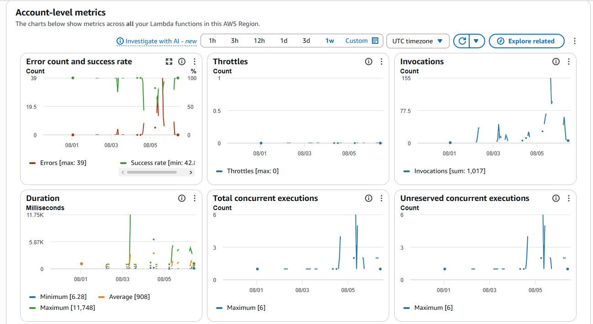
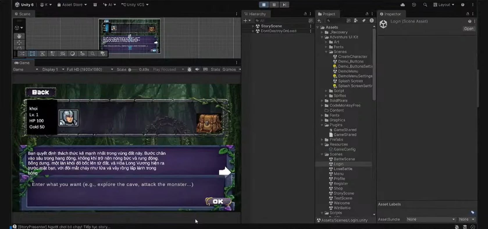

> **Original Post:** [Posted on AWS Study Group](https://www.facebook.com/groups/awsstudygroupfcj/permalink/2236558767109083)

Lately, my team has been focusing on developing a 2D RPG game integrated with Generative AI (an AI Dungeon RPG) to automatically drive the storyline. Our current tech stack is **.NET 8, AWS Serverless, and Unity**. The project is still a work in progress (WIP), but to be honest, setting up the Serverless Monorepo architecture gave us quite a hard time right from the start. 😅

Below are 5 practical, hard-learned lessons that our team has been dealing with. For anyone looking to dive into the AWS ecosystem, Amazon Bedrock, or Unity game development, feel free to use this as a reference!

### 1. The AWS Lambda "Cold Start" Nightmare

When we first tested the turn-processing API, the Lambda function sometimes took 3 to 5 seconds to boot up. As a result, right after the player selected an action, the screen would freeze, making it look like the game had crashed. The root cause was that on the initial invocation (Cold Start), AWS needed time to initialize the container environment and load the .NET 8 assemblies.

**👉 Our Solution:** 
We decided to compile our Backend using **Native AOT** to squeeze the binary size down as much as possible. Alongside that, we enabled the **AWS Lambda SnapStart** feature. Thanks to this combo, the startup latency has now been reduced to under 1 second, and players can barely notice any delay.

*(Chart tracking AWS Lambda invocation frequency and latency on CloudWatch)*

---

### 2. Amazon Bedrock: Great Responses, But It Breaks Game Rules

While testing prompts with the AI service (Amazon Bedrock), the AI would sometimes get a bit too "creative" and automatically grant the character high-tier loot or fully restore their health, even though there were clearly no health potions in the inventory! The nature of Large Language Models (LLMs) is highly creative, so if we don't strictly fence in the rules, the AI can easily deviate from the original game logic.

**👉 Our Solution:**
I separated the prompt into 3 distinct layers:
- `system_prompt` to hold the strict, hardcoded rules of the game.
- `story_prompt` to store the current context.
- `summary_prompt` to summarize the action history.

Furthermore, on the Backend side, the team built an additional **data moderation and processing layer**. It acts as a filter: scrutinizing whether the AI is making up its own rules or injecting cheat items. After ensuring it's safe, the system forces the entire response into a standard JSON format before saving it to the database or sending it back to Unity for rendering.

*(AI storyline interface automatically rendered inside the Unity game)*

---

### 3. The Backend and Unity Data DTO "Mismatch"

Because the game is in continuous development, character structures, items, and Boss stats are constantly changing. The pain was that every time the Backend (C#) modified a DTO, Unity would immediately throw JSON parsing errors or data type mismatches. Manually fixing this on both sides was incredibly time-consuming.

**👉 Our Solution:**
We created a dedicated **Shared Library** (`GameShared.dll` file) specifically to house all the shared Data Models & DTOs for both sides. Then, we configured an *MSBuild PostBuild Event*: every time the Backend finishes building, this `.dll` file is automatically copied straight into Unity's `Assets/Plugins/` folder. Thanks to this, both sides always have 100% synchronized data without any manual intervention.

---

### 4. The Amazon Cognito Login Experience

Our game uses **Amazon Cognito** to manage player accounts and authenticate via OTP sent to Email. However, it's a terrible experience if users are forced to log in from scratch every time they open the app.

**👉 Our Solution:**
To overcome this, the team implemented a background **Silent Login API** mechanism. By storing and utilizing the Refresh Token, the client (the game) can smoothly and automatically restore the previous session, allowing users to jump right into playing as soon as they open the game.

---

### 5. The DynamoDB Data Table Optimization Puzzle

Getting used to a NoSQL database like **DynamoDB** is a challenge. If you don't choose the right `Partition Key` or `Sort Key` from the start, later on, when you want to retrieve the story history (StorySession) or item list (Inventory), the system will have to use the `Scan` command. This command is not only extremely slow but also burns through AWS resource costs.

**👉 Our Solution:**
Currently, we are sitting down to standardize the Data Modeling schema. The team decided to use `UserId` as the Partition Key, `SessionId#Timestamp` as the Sort Key, and combined this by setting up additional **Global Secondary Indexes (GSI)** to ensure that every query is maximally optimized.

---
> *The project is still under active development, so there will definitely be more interesting technical lessons in the near future. Hopefully, these small shares will provide some useful insights for anyone looking into the Serverless model or applying Generative AI to game development.*