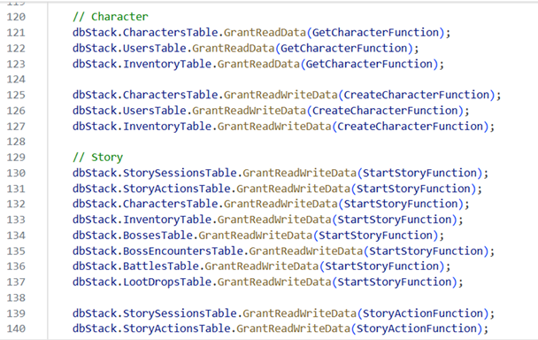
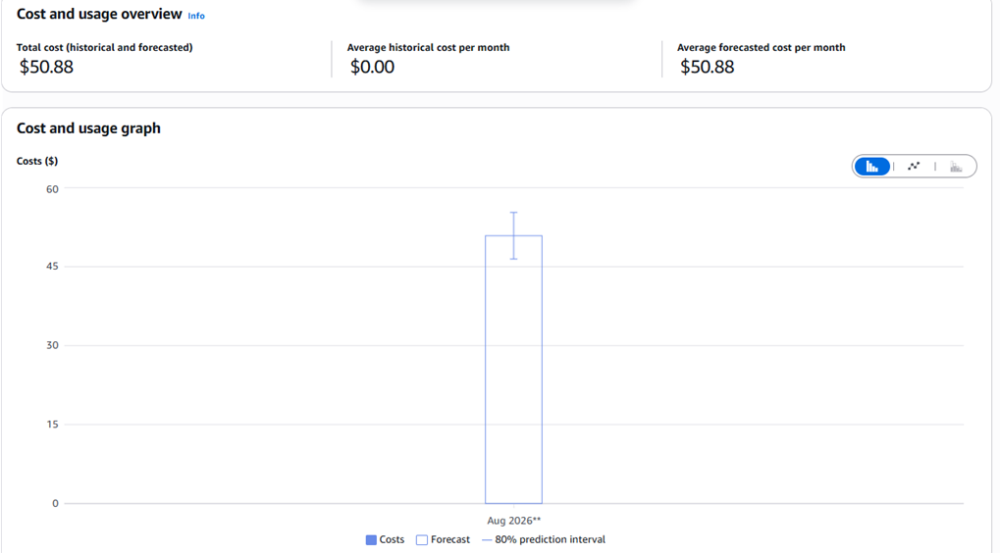
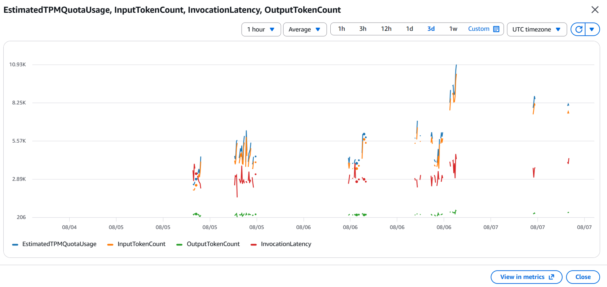

> **Nguồn bài viết:** [Bài đăng trên nhóm AWS Study Group](https://www.facebook.com/groups/awsstudygroupfcj/permalink/2237641900334103)

Khi bắt tay vào làm một game nhập vai 2D tương tác với AI bằng kiến trúc Serverless (dùng Unity với backend .NET 8, AWS Lambda, Amazon Bedrock), cứ thấy AI trả lời mượt trong game là sướng rồi. Nhưng khi ứng dụng bắt đầu "phình to" và các lượt gọi AI diễn ra liên tục, nhóm mới nhận ra một bài học đắt giá: Nếu không tính toán chi phí và bảo mật ngay từ đầu, hóa đơn AWS cuối tháng thực sự sẽ là một cú sốc lớn. 🥶

Anh em nào đang định làm dự án có sử dụng AI trên AWS có thể tham khảo bài chia sẻ này để tránh mất tiền oan nhé:

### 1. Tiền Token LLM tăng theo cấp số nhân nếu cứ nhét toàn bộ lịch sử chat

Mỗi lần người chơi tương tác, app phải gọi qua Amazon Bedrock (dùng mô hình Claude hoặc Llama). Các model này tính tiền theo cả token đầu vào lẫn đầu ra. Nếu cứ mỗi turn (lượt chơi) lại gửi toàn bộ lịch sử trò chuyện từ đầu đến cuối thì prompt càng ngày sẽ càng dài ra, đồng nghĩa với việc tiền token tăng chóng mặt.

**👉 Cách giải quyết của team:**
Nhóm mình dùng một file `summary_prompt` nén bớt các lượt chơi cũ thành một đoạn tóm tắt ngắn gọn trước khi gửi cho AI. Đồng thời, những dữ liệu cố định như thông tin địa điểm hay thuộc tính nhân vật sẽ được cache (lưu trữ tạm) lại vào bảng DynamoDB chứ không bắt AI phải "nhớ" hay suy luận lại từ đầu.

---

### 2. Siết chặt bảo mật IAM theo nguyên tắc Least Privilege

Lúc mới dựng app, vì muốn code chạy nhanh nên mình hay tiện tay gán quyền `AdministratorAccess` hoặc `FullAccess` cho hàm Lambda. Cách này giúp dev làm nhanh lúc đầu, nhưng lại là một lỗ hổng bảo mật cực kỳ nguy hiểm nếu đưa lên môi trường thật. 

**👉 Cách giải quyết của team:**
Nhờ việc sử dụng cơ sở hạ tầng dưới dạng code (AWS CDK), nhóm đã rèn được thói quen phân quyền tối thiểu (**Least Privilege**). Function Lambda nào chỉ cần đọc dữ liệu thì gán `grantReadData()`, function nào gọi Bedrock thì chỉ cấp đúng quyền `bedrock:InvokeModel`. Việc này nhằm giới hạn phạm vi ảnh hưởng, hạn chế tối đa các lỗ hổng bảo mật mà hệ thống có thể gặp phải.

*(Hình ảnh minh họa chính sách phân quyền chi tiết các function cho Lambda)*

---

### 3. Cài đặt AWS Budgets và CloudWatch Alarms trước khi gõ dòng code đầu tiên

Nhiều bạn dev mới làm quen với Cloud rất dễ dính "quả đắng" mất tiền oan vì vô tình để lặp vòng lặp vô tận (infinite loop) gọi API, hoặc quên xóa các tài nguyên thử nghiệm. 

**👉 Cách giải quyết của team:**
Kinh nghiệm xương máu là hãy thiết lập **AWS Budgets** ngay từ đầu để nhận email cảnh báo. Ví dụ, thiết lập nếu chi phí chạm ngưỡng 5 đô hay 10 đô là hệ thống gửi mail báo ngay lập tức. 

Bên cạnh đó, việc cài đặt **CloudWatch Alarm** để theo dõi số lượng request và tỷ lệ error của Lambda là cực kỳ cần thiết. Nó giúp nhóm phát hiện sớm nếu app dính lỗi lặp vô tận hay bị spam request rác từ bên ngoài.

*(Dự báo chi phí hàng tháng qua Cost Explorer)*

*(Theo dõi số lượng Request và Error trên CloudWatch để xử lý kịp thời)*

---

> *Mấy bài học này nghe thì có vẻ lý thuyết, nhưng đúng là phải tự tay làm, tự trải nghiệm cảm giác "lo nơm nớp" vì hóa đơn thì mới nhớ lâu được. Mình cũng chỉ mới ở giai đoạn bắt đầu làm quen với hệ sinh thái AWS thôi, nên chắc chắn hệ thống còn nhiều chỗ cần tối ưu thêm. Hy vọng chút trải nghiệm thực tế này hữu ích với các bạn!*