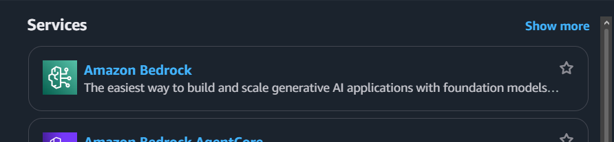

#### Yêu cầu Môi trường

Trước khi bắt đầu workshop, hãy đảm bảo bạn đã cài đặt và cấu hình các công cụ cũng như dịch vụ sau:

1. **Tài khoản AWS & Quyền truy cập Bedrock:**
   - Một tài khoản AWS đang hoạt động.
   - Đã kích hoạt Model Access trong trang quản trị **AWS Bedrock** cho các mô hình **Anthropic Claude 3 (Haiku/Sonnet)** hoặc **Amazon Nova Micro/Lite** tại Region bạn chọn (khuyến nghị: `ap-southeast-1`).
   - Truy cập: *AWS Console → Bedrock → Model Access → Request Access*.

   

2. **Công cụ Phát triển:**
   - Cài đặt [.NET 8 SDK](https://dotnet.microsoft.com/download/dotnet/8.0).
   - Cài đặt [Node.js (v18+)](https://nodejs.org/) và **AWS CDK CLI**:
     ```bash
     npm install -g aws-cdk
     ```
   - Cài đặt và cấu hình [AWS CLI v2](https://docs.aws.amazon.com/cli/latest/userguide/getting-started-install.html) với IAM credentials của bạn:
     ```bash
     aws configure
     # AWS Access Key ID: <your-key>
     # AWS Secret Access Key: <your-secret>
     # Default region name: ap-southeast-1
     # Default output format: json
     ```

3. **Unity Client (Tùy chọn — cần thiết để kiểm thử E2E):**
   - Cài đặt [Unity 2022.3 LTS](https://unity.com/) hoặc mới hơn (thông qua Unity Hub).
   - Các Unity packages cần thiết (đã có sẵn trong project):
     - **Input System** (`com.unity.inputsystem`)
     - **TextMesh Pro** (`com.unity.textmeshpro`)
   - Project Unity nằm trong thư mục `Assets/` — thêm thư mục gốc của repository vào Unity Hub như một project hiện có.

---

#### Quyền IAM cần thiết

Tài khoản IAM sử dụng AWS CLI cần có quyền tối thiểu để khởi tạo tài nguyên thông qua AWS CDK:
- `cloudformation:*`
- `lambda:*`
- `apigateway:*`
- `dynamodb:*`
- `cognito-idp:*`
- `iam:*`
- `bedrock:InvokeModel`
- `s3:*` *(cho CDK bootstrap bucket và lưu trữ template cốt truyện)*

```json
{
    "Version": "2012-10-17",
    "Statement": [
        {
            "Effect": "Allow",
            "Action": [
                "cloudformation:*",
                "lambda:*",
                "apigateway:*",
                "dynamodb:*",
                "cognito-idp:*",
                "iam:CreateRole",
                "iam:AttachRolePolicy",
                "iam:PassRole",
                "bedrock:InvokeModel",
                "s3:*"
            ],
            "Resource": "*"
        }
    ]
}
```

---

#### Lưu ý quan trọng

> **Xác nhận Email Cognito**: Mặc định, AWS Cognito yêu cầu xác nhận email trước khi người dùng có thể đăng nhập. Sau khi đăng ký qua game hoặc API, bạn có thể cần xác nhận thủ công qua Cognito Console (*User Pools → Users → Confirm User*) hoặc cấu hình tự động xác nhận trong CDK stack cho mục đích kiểm thử.

> **Region**: Workshop này sử dụng `ap-southeast-1` (Singapore) làm region mặc định. Bạn có thể dùng `us-east-1` hoặc `us-west-2` nếu muốn, nhưng hãy đảm bảo đã kích hoạt Bedrock model access tại region đó.