#### AWS Cognito là gì và tại sao game này cần nó?

Hãy tưởng tượng **Amazon Cognito** như người bảo vệ đứng ở cửa vào của game — nó xử lý toàn bộ vấn đề **bạn là ai** trước khi cho phép bạn chạm vào bất kỳ dữ liệu game nào. Khi người chơi mở ứng dụng và nhập tên đăng nhập cùng mật khẩu, Cognito là người kiểm tra thông tin đó, và nếu mọi thứ hợp lệ, nó sẽ trả về một **JWT token** (một tấm thẻ điện tử có chữ ký). Từ đó về sau, mọi API call mà Unity Client thực hiện đều mang theo token này, và API Gateway sẽ tự động xác thực nó trước khi chuyển tiếp request tới Lambda.

Nếu không có Cognito, bạn phải tự xây dựng hệ thống xác thực từ đầu (rủi ro cao) hoặc tự lưu mật khẩu vào DynamoDB (rất nguy hiểm). Cognito xử lý tất cả — băm mật khẩu, hết hạn token, refresh token, xác minh email — một cách an toàn và ở quy mô lớn.

Trong dự án này, Cognito được **tự động tạo bởi CDK stack** (`ApiStack.cs`). Bạn không cần nhấn nút nào thủ công. Nhưng hiểu được nó tạo ra cái gì và hoạt động ra sao là cần thiết để debug và cấu hình Unity Client đúng cách.

---

#### CDK tạo gì cho bạn

Khi bạn chạy `cdk deploy GameLambdaStack`, infrastructure stack tự động khởi tạo:

| Tài nguyên | Tên / Format | Mục đích |
|---|---|---|
| **User Pool** | `GameUserPool` | Thư mục người dùng chính — lưu tất cả tài khoản người chơi đã đăng ký |
| **App Client** | `GameUserPoolClient` | "Chìa khóa" mà ứng dụng dùng để giao tiếp với User Pool — không có client secret (phù hợp với game/mobile client) |
| **User Pool Domain** | *(tùy chọn)* | Giao diện Hosted UI cho OAuth flow (không dùng trong dự án này — chúng ta dùng direct API auth) |

Sau khi `cdk deploy` hoàn thành, terminal in ra:

```
Outputs:
GameStack.CognitoUserPoolId     = ap-southeast-1_xxxxxxx
GameStack.CognitoAppClientId    = 1a2b3c4d5e6f7g8h9i0j1k2l3m
GameStack.ApiGatewayUrl         = https://xxxxxxx.execute-api.ap-southeast-1.amazonaws.com/prod/
```

**Lưu lại ba giá trị này** — bạn sẽ dán chúng vào `GameConfig.asset` trong Unity.

---

#### Luồng xác thực hoạt động như thế nào

Đây là toàn cảnh những gì xảy ra khi người chơi đăng nhập:

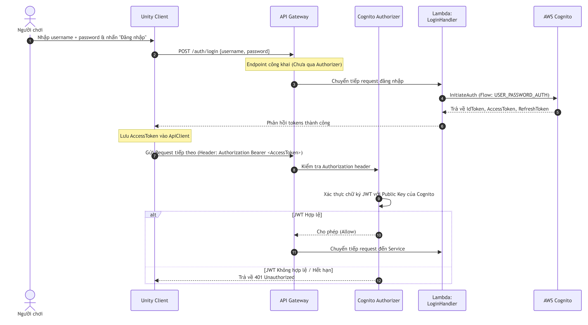

---

#### Tình huống USER_NOT_CONFIRMED

Khi bạn đăng ký tài khoản mới (`POST /auth/register`), Cognito tạo người dùng nhưng **đặt họ ở trạng thái "UNCONFIRMED" theo mặc định**. Người dùng sẽ không thể đăng nhập cho đến khi tài khoản được xác nhận.

Mặc định, Cognito gửi **email xác minh** đến địa chỉ đã đăng ký. Sau khi người dùng nhấn vào link (hoặc nhập mã), tài khoản trở thành `CONFIRMED` và có thể đăng nhập.

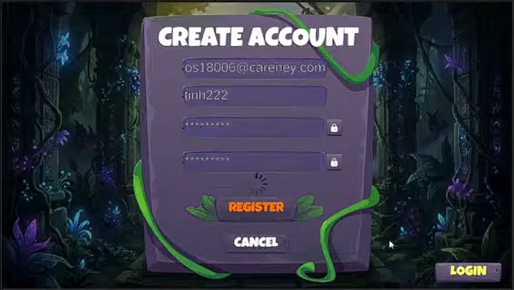
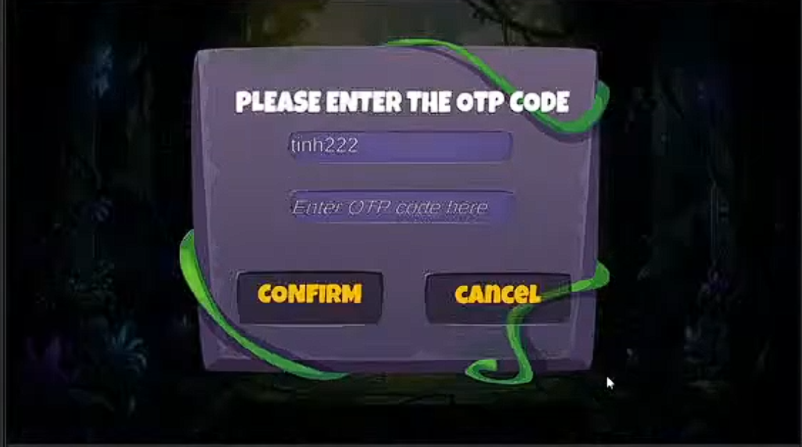
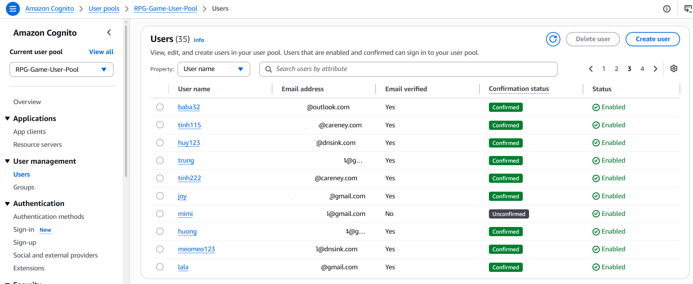

**Để phục vụ mục đích kiểm thử**, bạn có hai cách bỏ qua bước này:

---

##### Cách 1: Xác nhận thủ công qua Cognito Console *(Nhanh nhất để test)*

1. Mở [Amazon Cognito Console](https://console.aws.amazon.com/cognito/).
2. Nhấn **User Pools** ở thanh điều hướng bên trái.
3. Chọn User Pool của bạn (tên `GameUserPool` hoặc tương tự).
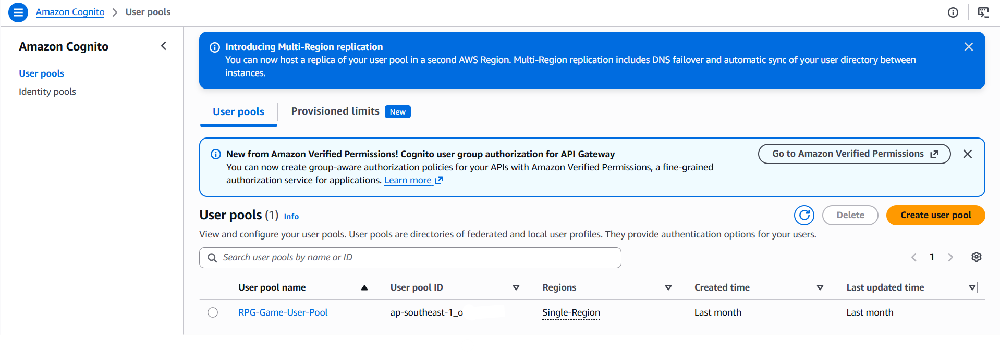
4. Nhấn tab **Users**.
5. Tìm người dùng vừa đăng ký (tìm theo username hoặc email).
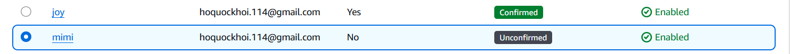
6. Nhấn vào tên người dùng để mở trang chi tiết.
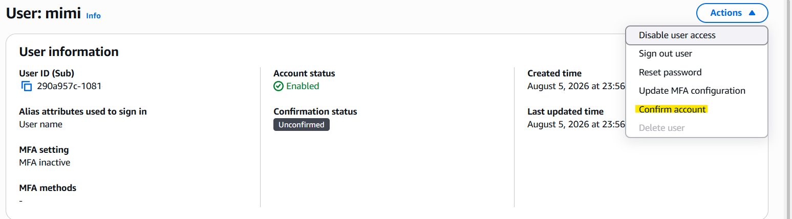
7. Nhấn **Actions** → **Confirm user**.

Trạng thái người dùng sẽ chuyển từ `UNCONFIRMED` sang `CONFIRMED` và họ có thể đăng nhập ngay.

---

##### Cách 2: Xác nhận qua AWS CLI *(Nhanh hơn nếu quen dùng CLI)*

```bash
aws cognito-idp admin-confirm-sign-up \
  --user-pool-id ap-southeast-1_AbCdEfGhI \
  --username player1 \
  --region ap-southeast-1
```

Thay `ap-southeast-1_AbCdEfGhI` bằng `CognitoUserPoolId` thực tế từ output CDK của bạn.

---

#### Hiểu về JWT Tokens

Cognito trả về ba token khi đăng nhập thành công. Đây là vai trò của từng token trong dự án này:

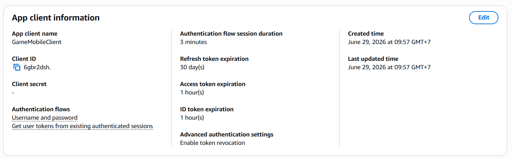

| Token | Thời hạn | Dùng để |
|---|---|---|
| **Access Token** | 1 giờ | Gửi trong header `Authorization: Bearer` cho các API call. Được API Gateway Cognito Authorizer xác thực. |
| **ID Token** | 1 giờ | Chứa thông tin định danh người dùng (username, email, sub/userId). `LoginHandler` trích xuất claim `sub` để dùng làm `userId`. |
| **Refresh Token** | 30 ngày | Dùng để lấy Access/ID token mới khi chúng hết hạn — không cần người dùng nhập lại mật khẩu. |

Trong Unity Client (`RealAuthService.cs`), Access Token được lưu vào `ApiClient` thông qua `ApiClient.Instance.SetAuth(token)` sau khi đăng nhập thành công. Mọi API call tiếp theo tự động đính kèm nó.

---

#### Cấu hình Unity Client với các giá trị Cognito

Sau khi có output từ CDK, mở Unity Editor:

1. Trong panel **Project** → `Assets/Resources/` → chọn `GameConfig.asset`


2. Trong **Inspector**, điền vào:

   | Field trong Inspector | CDK Output Key | Ví dụ giá trị |
   |---|---|---|
   | **Aws Cognito User Pool Id** | `CognitoUserPoolId` | `ap-southeast-1_AbCdEfGhI` |
   | **Aws Cognito Client Id** | `CognitoAppClientId` | `1a2b3c4d5e6f7g8h9i0j...` |
   | **Aws Cognito Region** | *(region bạn deploy)* | `ap-southeast-1` |

3. Nhấn **Ctrl+S** để lưu.

---

#### Lỗi thường gặp & Cách xử lý

| Lỗi | Nguyên nhân | Cách sửa |
|---|---|---|
| `errorCode: USER_NOT_CONFIRMED` | Người dùng đã đăng ký nhưng chưa xác nhận | Xác nhận qua Console hoặc CLI (xem hướng dẫn trên) |
| `NotAuthorizedException: Incorrect username or password` | Thông tin đăng nhập sai | Kiểm tra lại username/password. Lưu ý: Cognito username có phân biệt hoa thường |
| `UserNotFoundException` | Username không tồn tại trong User Pool | Đảm bảo đã đăng ký với đúng User Pool ID |
| `401 Unauthorized` trên các route được bảo vệ | JWT token hết hạn hoặc không được đính kèm | Đăng nhập lại để lấy token mới. Kiểm tra `ApiClient.SetAuth(token)` đã được gọi |
| `Invalid client id` | Sai `CognitoAppClientId` trong `GameConfig.asset` | Sao chép chính xác giá trị `CognitoAppClientId` từ CDK output |

---

#### IAM — Quyền hạn cần thiết cho Cognito

##### Tại sao cần IAM?

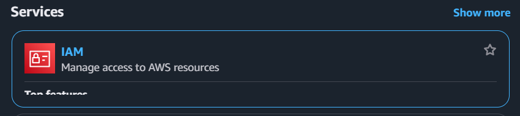

Cognito không hoạt động độc lập — Lambda functions cần quyền IAM để **gọi Cognito API** (đăng nhập, đăng ký, xác nhận user...). Ngoài ra, tài khoản AWS của bạn cần quyền IAM để **CDK có thể tạo** Cognito User Pool trong quá trình deploy.

Có hai lớp IAM cần quan tâm:

1. **Quyền của CDK deployer** (tài khoản IAM chạy `cdk deploy`) — cần tạo tài nguyên Cognito
2. **Quyền của Lambda Execution Role** — cần gọi Cognito API lúc runtime

---

##### Lớp 1: Quyền IAM cho CDK Deployer

Tài khoản IAM dùng để chạy `aws configure` và `cdk deploy` cần có quyền tạo tài nguyên Cognito:

```json
{
  "Effect": "Allow",
  "Action": [
    "cognito-idp:CreateUserPool",
    "cognito-idp:CreateUserPoolClient",
    "cognito-idp:DeleteUserPool",
    "cognito-idp:DeleteUserPoolClient",
    "cognito-idp:DescribeUserPool",
    "cognito-idp:UpdateUserPool",
    "cognito-idp:SetUserPoolMfaConfig",
    "cognito-idp:AdminConfirmSignUp",
    "cognito-idp:AdminCreateUser"
  ],
  "Resource": "*"
}
```

> **Cách dễ hơn cho môi trường dev**: Dùng `cognito-idp:*` để cho phép toàn bộ quyền Cognito. Trong production, nên thu hẹp lại theo nguyên tắc **Least Privilege** (chỉ cấp đúng quyền cần thiết).

---

##### Lớp 2: Lambda Execution Role — Quyền gọi Cognito lúc Runtime

Khi người chơi nhấn "Đăng nhập", Lambda function (`LoginHandler`) cần gọi Cognito API để xác thực. Điều này yêu cầu **Lambda Execution Role** có quyền `cognito-idp:InitiateAuth`.

Trong dự án này, CDK tự động tạo và gán quyền này cho Lambda thông qua `LambdaStack.cs`. Bạn không cần làm thủ công. Cấu hình CDK trông như sau:

```csharp
// Trong LambdaStack.cs
// CDK tự động tạo Execution Role và gán các quyền cần thiết
var loginFunction = new Function(this, "LoginFunction", new FunctionProps
{
    Runtime = Runtime.DOTNET_8,
    Handler = "GameBackend.Handlers::LoginHandler::Handler",
    Code = Code.FromAsset("path-to-deploy-package.zip"),
    Environment = new Dictionary<string, string>
    {
        ["COGNITO_USER_POOL_ID"] = userPool.UserPoolId,
        ["COGNITO_CLIENT_ID"]   = userPoolClient.UserPoolClientId,
    }
});

// Gán quyền gọi Cognito InitiateAuth cho Lambda
userPool.Grant(loginFunction, "cognito-idp:InitiateAuth");
userPool.Grant(loginFunction, "cognito-idp:SignUp");
userPool.Grant(loginFunction, "cognito-idp:AdminConfirmSignUp");
userPool.Grant(loginFunction, "cognito-idp:AdminGetUser");
```

Biến môi trường `COGNITO_USER_POOL_ID` và `COGNITO_CLIENT_ID` được Lambda đọc tại runtime để biết cần gọi vào User Pool nào — không hardcode trong code.

---

##### Cách kiểm tra IAM của Lambda trên Console

Nếu bạn gặp lỗi liên quan đến quyền khi chạy API, làm theo các bước sau để kiểm tra:

1. Mở [AWS Lambda Console](https://console.aws.amazon.com/lambda/).
2. Chọn function bị lỗi (ví dụ: `LoginFunction`).

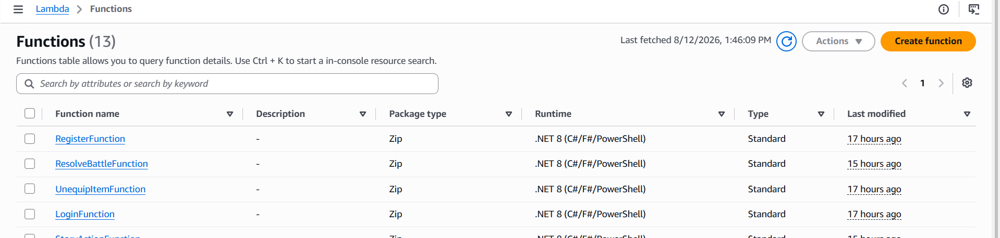

3. Vào tab **Configuration** → **Permissions**.
4. Nhấn vào tên **Execution role** (ví dụ: `LoginFunction-ServiceRole-xxxx`).

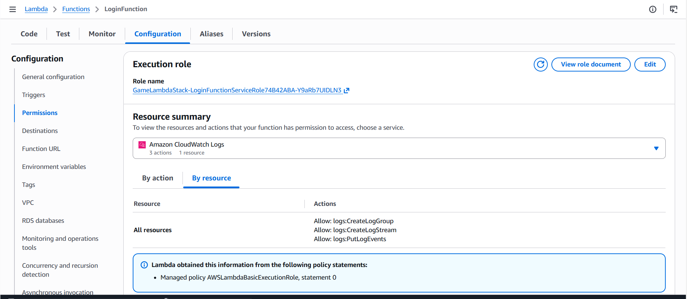

5. Trang IAM Console sẽ mở — xem danh sách policy được gắn vào role đó.

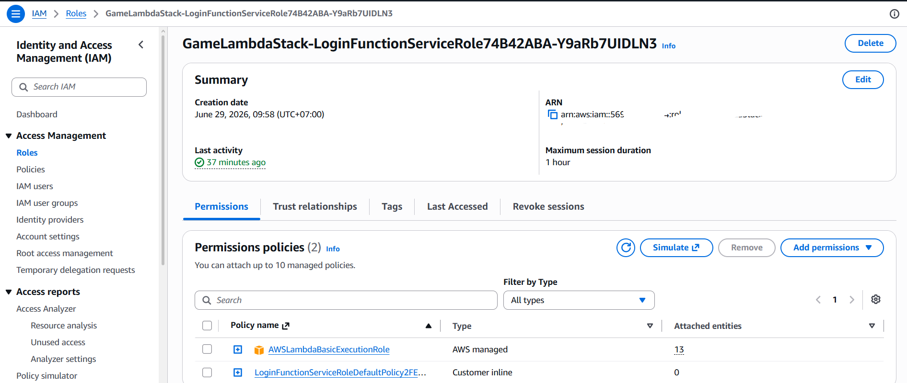

6. Kiểm tra xem có policy nào cho phép `cognito-idp:InitiateAuth` trên resource là User Pool ARN của bạn không.

Nếu thiếu, nhấn **Add permissions** → **Attach policies** để thêm quyền cần thiết.

---

##### Bảng tóm tắt quyền IAM theo từng Lambda

| Lambda Function | Cognito API cần gọi | Mô tả |
|---|---|---|
| `LoginHandler` | `cognito-idp:InitiateAuth` | Xác thực username/password, lấy JWT tokens |
| `RegisterHandler` | `cognito-idp:SignUp` | Tạo tài khoản người dùng mới trong User Pool |
| `RegisterHandler` | `cognito-idp:AdminConfirmSignUp` | Tự xác nhận user (chỉ dùng trong dev/auto-confirm flow) |
| `LoginHandler` | `cognito-idp:AdminGetUser` | Lấy thông tin user theo username để trả về `userId` |

---

##### Lỗi IAM thường gặp trong quá trình làm dự án

| Lỗi | Nguyên nhân | Cách sửa |
|---|---|---|
| `AccessDeniedException: User is not authorized to perform cognito-idp:InitiateAuth` | Lambda Execution Role thiếu quyền | Thêm quyền `cognito-idp:InitiateAuth` vào Execution Role của Lambda (xem hướng dẫn Console trên) |
| `UnauthorizedException` khi chạy `cdk deploy` | Tài khoản IAM deployer thiếu quyền `cognito-idp:CreateUserPool` | Thêm policy `cognito-idp:*` vào IAM user đang dùng `aws configure` |
| `ResourceNotFoundException` | Lambda đọc sai `COGNITO_USER_POOL_ID` từ biến môi trường | Kiểm tra biến môi trường trong Lambda Console → Configuration → Environment variables |
