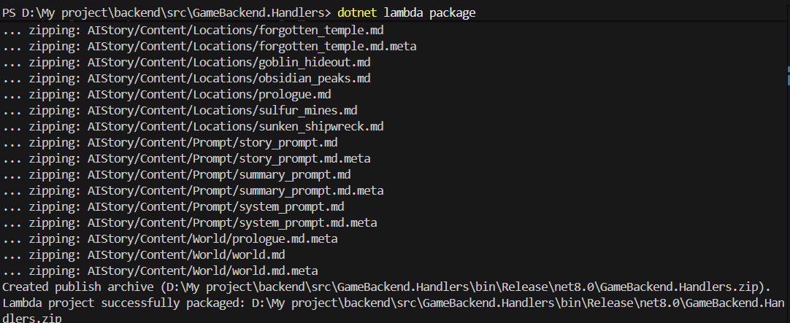
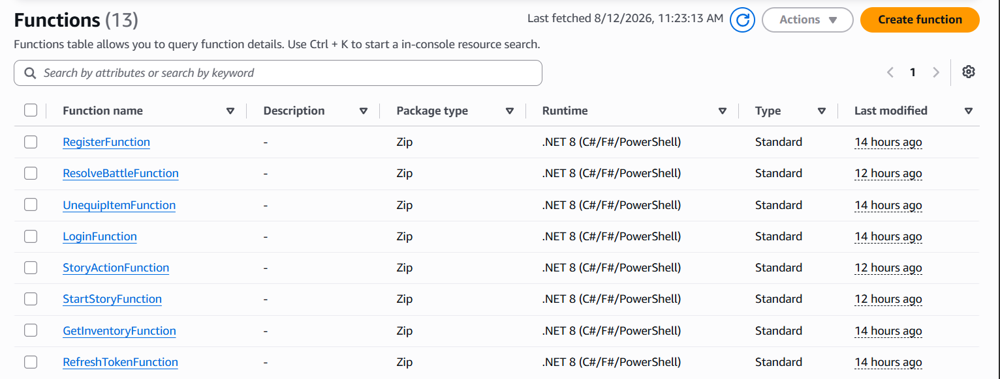
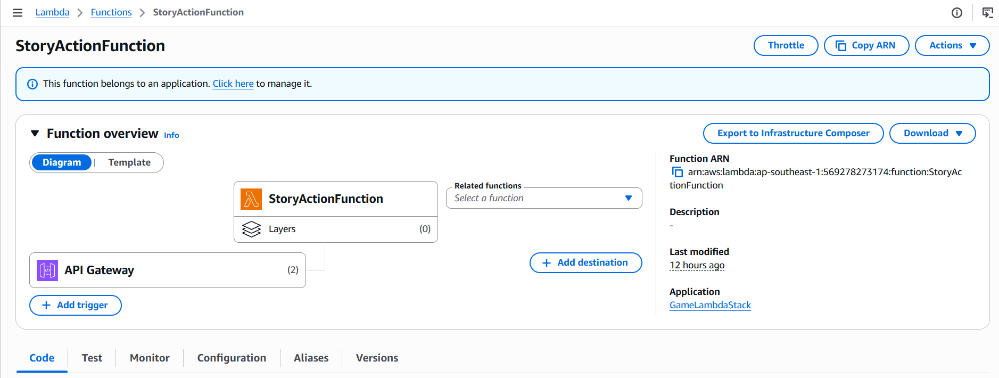
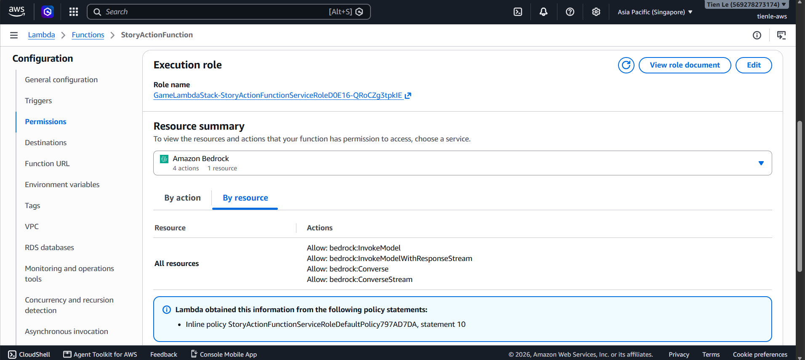
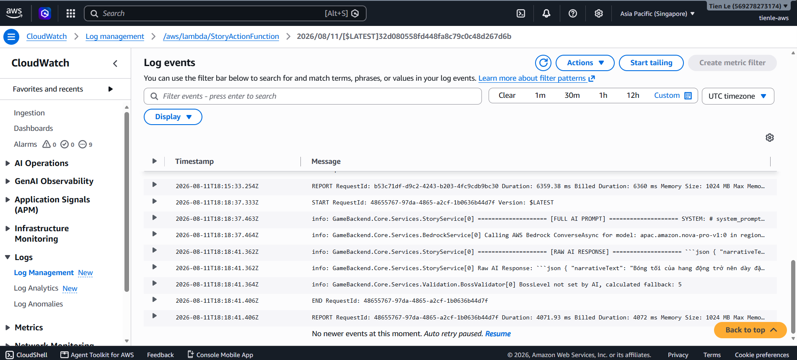

### Building & Deploying AWS Lambda Backend (.NET 8)

#### Overview

In the **AI Dungeon RPG Adventure Game**, **AWS Lambda** powered by the **.NET 8 (C#)** runtime serves as the serverless compute layer. To maintain a strict **Server-Authoritative** architecture and neutralize client-side cheating, all critical business logic—including turn-based battle calculations, inventory state updates, and Generative AI story invocations—is executed inside distributed Lambda functions.

The backend consists of **13 AWS Lambda Functions** organized into 5 functional modules:

| Module | Function Name | Description | Key AWS Service Interactions |
|---|---|---|---|
| **Auth** | `RegisterFunction` | Player registration & password hashing | Amazon DynamoDB (`Users`) |
| **Auth** | `LoginFunction` | Player authentication & JWT token generation | Amazon Cognito / DynamoDB |
| **Auth** | `RefreshTokenFunction` | Refreshes expired JWT session tokens | Amazon Cognito |
| **Character** | `GetCharacterFunction` | Fetches character profile, level, and stats | Amazon DynamoDB (`Characters`) |
| **Inventory** | `GetInventoryFunction` | Retrieves equipped gear & item inventory | Amazon DynamoDB (`Inventory`) |
| **Inventory** | `EquipItemFunction` | Equips gear and updates player stats | Amazon DynamoDB (`Inventory`, `Characters`) |
| **Inventory** | `UnequipItemFunction` | Unequips gear and resets stat modifiers | Amazon DynamoDB (`Inventory`, `Characters`) |
| **Battle** | `StartBattleFunction` | Initializes turn-based boss battle session | Amazon DynamoDB (`Battles`, `Bosses`) |
| **Battle** | `ResolveBattleFunction` | Calculates turn damage, crit, & loot drops | Amazon DynamoDB (`Battles`, `LootDrops`) |
| **Story AI** | `StartStoryFunction` | Initializes a new story session node | Amazon DynamoDB (`StorySessions`) |
| **Story AI** | `StoryActionFunction` | Invokes Bedrock AI (`amazon.nova-pro-v1:0`) | **AWS Bedrock**, Amazon S3, DynamoDB |

---

### Step 1: Package .NET 8 Lambda Backend Functions

1. Open your terminal and navigate to the Lambda Handlers project folder inside the monorepo:
   ```bash
   cd backend/src/GameBackend.Handlers
   ```

2. Restore NuGet dependencies and package the compiled binaries into a deployment Zip package:
   ```bash
   dotnet lambda package --configuration Release --output-package bin/Release/net8.0/deploy-package.zip
   ```

3. Verify that `deploy-package.zip` is created inside `bin/Release/net8.0/`.



---

### Step 2: C# Lambda Code Implementation (`StoryActionFunction`)

Below is the C# code snippet for `StoryActionFunction.cs`, showing how Lambda interfaces with **Amazon Bedrock (`amazon.nova-pro-v1:0`)** to generate dynamic RPG stories and choices:

```csharp
using System.Text.Json;
using Amazon.BedrockRuntime;
using Amazon.BedrockRuntime.Model;
using Amazon.Lambda.Core;
using Amazon.Lambda.APIGatewayEvents;
using GameBackend.Core.Services;

[assembly: LambdaSerializer(typeof(Amazon.Lambda.Serialization.SystemTextJson.DefaultLambdaJsonSerializer))]

namespace GameBackend.Handlers
{
    public class StoryActionFunction
    {
        private readonly IAmazonBedrockRuntime _bedrockClient;
        private readonly StoryService _storyService;

        public StoryActionFunction()
        {
            _bedrockClient = new AmazonBedrockRuntimeClient();
            _storyService = new StoryService();
        }

        public async Task<APIGatewayProxyResponse> FunctionHandler(APIGatewayProxyRequest request, ILambdaContext context)
        {
            context.Logger.LogInformation("Processing StoryActionFunction request...");

            try
            {
                var body = JsonSerializer.Deserialize<StoryActionRequest>(request.Body);
                
                // 1. Fetch story prompt template from S3 / Local Cache
                string prompt = $"Player Choice: {body.ChoiceText}. Generate next narrative and 3 choices.";

                // 2. Invoke Amazon Bedrock Nova Pro Model
                var payload = new
                {
                    inferenceConfig = new { max_new_tokens = 500, temperature = 0.7 },
                    messages = new[] { new { role = "user", content = new[] { new { text = prompt } } } }
                };

                var invokeRequest = new InvokeModelRequest
                {
                    ModelId = "amazon.nova-pro-v1:0",
                    ContentType = "application/json",
                    Accept = "application/json",
                    Body = new MemoryStream(System.Text.Encoding.UTF8.GetBytes(JsonSerializer.Serialize(payload)))
                };

                var response = await _bedrockClient.InvokeModelAsync(invokeRequest);
                using var reader = new StreamReader(response.Body);
                string responseJson = await reader.ReadToEndAsync();

                // 3. Save result state to DynamoDB
                await _storyService.SaveStoryNodeAsync(body.SessionId, responseJson);

                return new APIGatewayProxyResponse
                {
                    StatusCode = 200,
                    Headers = new Dictionary<string, string> { { "Content-Type", "application/json" } },
                    Body = responseJson
                };
            }
            catch (Exception ex)
            {
                context.Logger.LogError($"Error in StoryActionFunction: {ex.Message}");
                return new APIGatewayProxyResponse { StatusCode = 500, Body = ex.Message };
            }
        }
    }
}
```

---

### Step 3: Deploy Lambda Infrastructure via AWS CDK

1. Navigate to the `infrastructure` directory:
   ```bash
   cd infrastructure
   ```

2. Deploy only the Lambda serverless backend stack (CDK automatically provisions the 13 Lambda functions, IAM roles, and API Gateway routes):
   ```bash
   cdk deploy GameLambdaStack
   ```

---

### Step 4: Verify Lambda Functions in AWS Management Console

1. Log in to **AWS Management Console** and navigate to **AWS Lambda** (Ensure Region is set to `ap-southeast-1 Singapore`).
2. Click **Functions** in the left navigation menu. You should see all 13 deployed functions listed.



3. Click on **`StoryActionFunction`** to inspect its configuration details and API Gateway triggers.



4. Scroll down to **Configuration** → **Permissions** tab to verify the IAM Execution Role policies attached for Bedrock (`bedrock:InvokeModel`).



5. Open **Amazon CloudWatch Logs** to view real-time execution logs after triggering a story request from Unity Client or Postman.



---

### Result

You have successfully deployed and verified the **13 AWS Lambda (.NET 8)** serverless functions. The backend is now ready to process game events, compute combat outcomes, and generate Generative AI storylines in real time!
