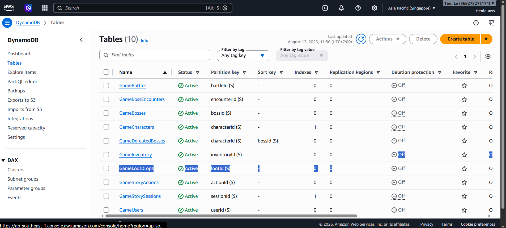
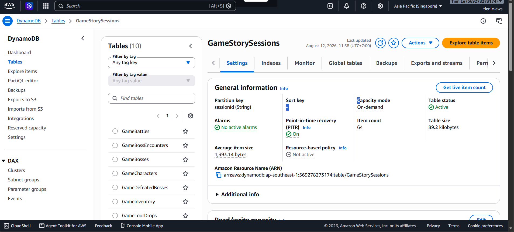
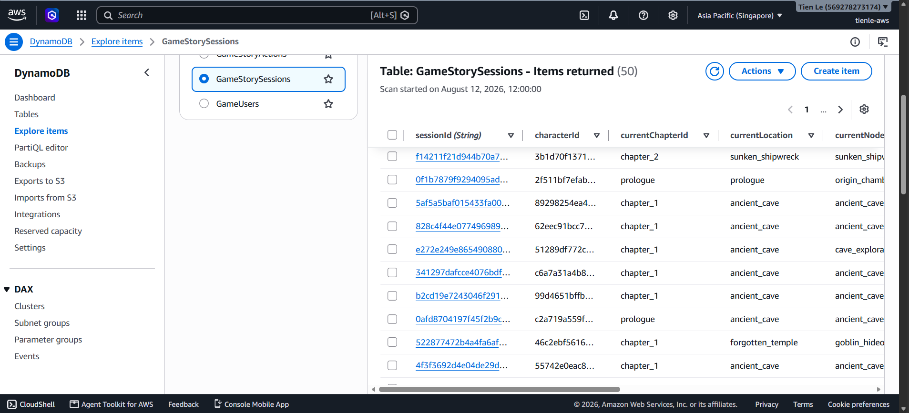

### Khởi tạo & Quản lý Cơ sở dữ liệu Amazon DynamoDB

#### Tổng quan

Trong tựa game **AI Dungeon RPG Adventure Game**, **Amazon DynamoDB** đóng vai trò là tầng cơ sở dữ liệu NoSQL chính. DynamoDB mang lại độ trễ cực thấp (dưới 10ms), khả năng tự động co giãn linh hoạt và mô hình chi phí trả theo lượng truy vấn (Pay-per-request), rất phù hợp để lưu trữ trạng thái game liên tục.

Để phục vụ các cơ chế game phức tạp—bao gồm tiến trình nhân vật, quản lý kho đồ, chiến đấu theo lượt và các phiên cốt truyện AI—kiến trúc cơ sở dữ liệu được chia thành **10 bảng chuyên biệt**:

| Tên Bảng (Table Name) | Partition Key (PK) | Sort Key (SK) / GSI | Thuộc Tính & Mô Tả Dữ Liệu |
|---|---|---|---|
| `GameUsers` | `userId` (String) | - | Thông tin tài khoản, hash mật khẩu, email, ngày đăng ký |
| `GameCharacters` | `characterId` (String) | GSI: `userId` | Level, kinh nghiệm (EXP), HP/MP, Công, Thủ, Vàng, danh sách vật phẩm trang bị |
| `GameInventory` | `inventoryId` (String) | GSI: `characterId` | Mã vật phẩm, loại trang bị, số lượng, chỉ số cộng thêm, trạng thái `IsEquipped` |
| `GameStorySessions` | `sessionId` (String) | GSI: `characterId` | Chương hiện tại, mã vị trí địa điểm, số lượt chơi, các cờ trạng thái |
| `GameStoryActions` | `actionId` (String) | GSI: `sessionId` | Nội dung lựa chọn người chơi, văn bản AI sinh ra, danh sách 3 lựa chọn mới |
| `GameBattles` | `battleId` (String) | GSI: `characterId` | Mã Boss, máu hiện tại của Boss, lịch sử các lượt đánh, trạng thái trận đấu |
| `GameBosses` | `bossId` (String) | - | Tên Boss, chỉ số gốc, hệ nguyên tố, danh sách kỹ năng đặc biệt |
| `GameBossEncounters` | `encounterId` (String) | - | Bản đồ địa điểm xuất hiện Boss, tỷ lệ gặp Boss, yêu cầu level tối thiểu |
| `GameLootDrops` | `lootId` (String) | - | Bảng tỷ lệ rớt đồ, danh sách vật phẩm thưởng, khoảng chỉ số ngẫu nhiên |
| `GameDefeatedBosses` | `characterId` (String) | `bossId` (String) | Lịch sử hạ gục Boss, thời gian hoàn thành, thành tích diệt Boss lần đầu |

---

### Bước 1: Định nghĩa Hạ tầng DynamoDB bằng AWS CDK (C#)

Các bảng DynamoDB được định nghĩa dạng Mã nguồn hạ tầng (IaC) thông qua **AWS CDK** trong C#. Dưới đây là đoạn mã tạo bảng `GameStorySessions` với chế độ On-Demand Billing và chỉ mục phụ Global Secondary Index (GSI):

```csharp
using Amazon.CDK.AWS.DynamoDB;
using Constructs;

namespace Infrastructure
{
    public class GameDatabaseStack
    {
        public Table StorySessionsTable { get; private set; }

        public GameDatabaseStack(Construct scope)
        {
            // Tạo bảng GameStorySessions
            StorySessionsTable = new Table(scope, "GameStorySessionsTable", new TableProps
            {
                TableName = "GameStorySessions",
                PartitionKey = new Attribute { Name = "sessionId", Type = AttributeType.STRING },
                BillingMode = BillingMode.PAY_PER_REQUEST,
                RemovalPolicy = Amazon.CDK.RemovalPolicy.DESTROY // Dành cho môi trường dev
            });

            // Thêm GSI để truy vấn danh sách session theo characterId
            StorySessionsTable.AddGlobalSecondaryIndex(new GlobalSecondaryIndexProps
            {
                IndexName = "CharacterId-Index",
                PartitionKey = new Attribute { Name = "characterId", Type = AttributeType.STRING },
                ProjectionType = ProjectionType.ALL
            });
        }
    }
}
```

---

### Bước 2: Triển khai Các Bảng DynamoDB lên AWS bằng AWS CDK CLI

1. Mở terminal và di chuyển vào thư mục hạ tầng `infrastructure`:
   ```bash
   cd infrastructure
   ```

2. Biên dịch và tổng hợp file template CloudFormation để kiểm tra schema bảng:
   ```bash
   cdk synth
   ```

3. Thực thi lệnh deploy riêng cho Stack Cơ sở dữ liệu để tự động khởi tạo 10 bảng DynamoDB trên AWS (Region `ap-southeast-1 Singapore`):
   ```bash
   cdk deploy GameDatabaseStack
   ```

4. Nhập `y` để xác nhận triển khai. AWS CDK sẽ khởi tạo đồng thời 10 bảng thông qua dịch vụ AWS CloudFormation.

---

### Bước 3: Khai báo C# Entity Data Model (`StorySession.cs`)

Hệ thống .NET 8 Lambda Backend tương tác với DynamoDB thông qua mô hình Object Persistence Model trong AWS SDK:

```csharp
using Amazon.DynamoDBv2.DataModel;

namespace GameBackend.Core.Models
{
    [DynamoDBTable("GameStorySessions")]
    public class StorySession
    {
        [DynamoDBHashKey("sessionId")]
        public string SessionId { get; set; } = Guid.NewGuid().ToString();

        [DynamoDBProperty("characterId")]
        public string CharacterId { get; set; } = string.Empty;

        [DynamoDBProperty("currentLocation")]
        public string CurrentLocation { get; set; } = "prologue";

        [DynamoDBProperty("currentChapterId")]
        public string CurrentChapterId { get; set; } = "chapter_1";

        [DynamoDBProperty("turnCounter")]
        public int TurnCounter { get; set; } = 0;

        [DynamoDBProperty("createdAt")]
        public string CreatedAt { get; set; } = DateTime.UtcNow.ToString("o");
    }
}
```

---

### Bước 4: Cơ chế Ghi Dữ liệu (Cách Dữ liệu được Lưu lên DynamoDB từ Backend)

Khi người chơi thực hiện hành động trong Unity Client (ví dụ chọn nhánh cốt truyện hoặc đánh Boss), Backend sẽ lưu và cập nhật trạng thái mới nhất lên DynamoDB thông qua tầng Repository sử dụng `IDynamoDBContext`:

```csharp
using Amazon.DynamoDBv2.DataModel;
using GameBackend.Core.Models;

namespace GameBackend.Core.Repositories
{
    public class StoryRepository : IStoryRepository
    {
        private readonly IDynamoDBContext _context;

        public StoryRepository(IDynamoDBContext context)
        {
            _context = context;
        }

        // 1. Lưu hoặc cập nhật trạng thái phiên chơi cốt truyện
        public async Task SaveSessionAsync(StorySession session)
        {
            session.UpdatedAt = DateTime.UtcNow;
            await _context.SaveAsync(session);
        }

        // 2. Lưu lịch sử lượt chơi (Lựa chọn người chơi + Cốt truyện AI sinh ra)
        public async Task SaveActionAsync(StoryAction action)
        {
            await _context.SaveAsync(action);
        }

        // 3. Truy vấn phiên chơi theo characterId qua chỉ mục GSI
        public async Task<StorySession?> GetSessionByCharacterIdAsync(string characterId)
        {
            var config = new DynamoDBOperationConfig
            {
                IndexName = "CharacterId-Index"
            };

            var search = _context.QueryAsync<StorySession>(characterId, config);
            var results = await search.GetRemainingAsync();
            return results.FirstOrDefault();
        }
    }
}
```

#### Quy trình Lưu Dữ liệu lên DynamoDB:
1. **Khởi tạo Sự kiện:** Unity Client gửi POST request chứa lựa chọn tới API Gateway → `StoryActionFunction` (AWS Lambda).
2. **Xử lý Logic & Gọi AI:** `StoryService` xử lý lựa chọn và gọi Bedrock `amazon.nova-pro-v1:0` để sinh văn bản cốt truyện và các lựa chọn mới.
3. **Gọi Tầng Repository:** `StoryService` gọi `_storyRepository.SaveSessionAsync(session)` và `SaveActionAsync(action)`.
4. **Ghi lên DynamoDB:** `DynamoDBContext.SaveAsync()` mã hóa đối tượng C# Model và thực thi lệnh `PutItem` / `UpdateItem` lên các bảng DynamoDB (`GameStorySessions`, `GameStoryActions`).

---

### Bước 5: Kiểm tra các Bảng DynamoDB trên AWS Management Console

1. Đăng nhập vào **AWS Management Console** và mở dịch vụ **Amazon DynamoDB** (Region: `ap-southeast-1 Singapore`).
2. Chọn **Tables** ở menu bên trái. Kiểm tra đầy đủ 10 bảng `Game*` đã ở trạng thái `Active`.



3. Nhấp chọn bảng **`GameStorySessions`** để xem thông tin chi tiết.



4. Nhấp vào mục **Explore items** ở menu bên trái, chọn bảng `GameStorySessions` để xem dữ liệu JSON thực tế được lưu trữ từ game.



---

### Kết quả

Bạn đã hoàn tất việc khởi tạo, tích hợp và kiểm tra tầng cơ sở dữ liệu **Amazon DynamoDB**. 10 bảng NoSQL đã sẵn sàng lưu trữ trạng thái người chơi, kho đồ, lượt đánh combat và tiến trình cốt truyện AI với độ trễ tối ưu!
