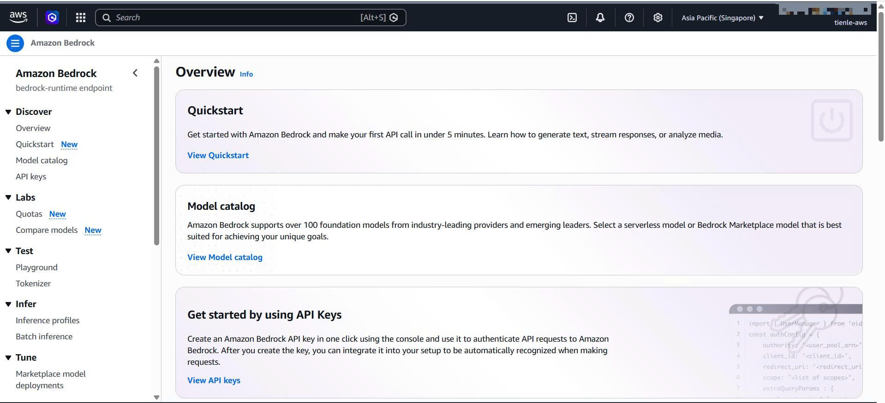
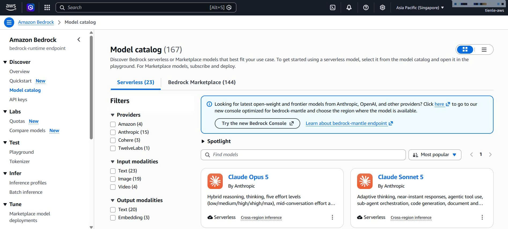
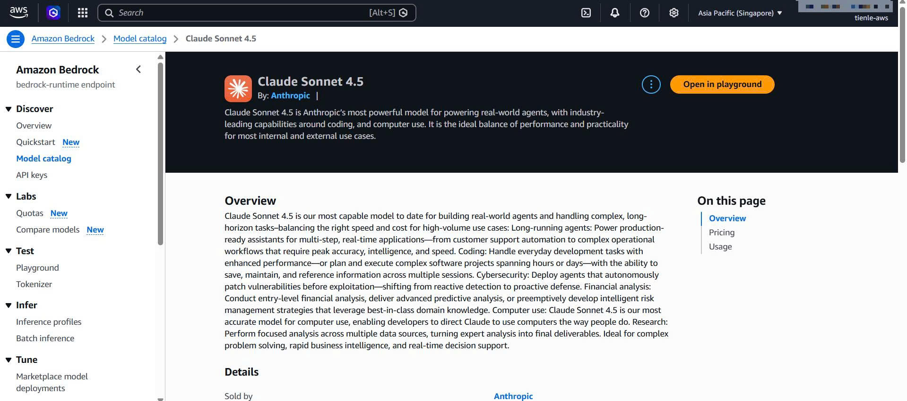

#### Hướng dẫn kết nối và cấu hình AWS Bedrock cho AI Dungeon Master

Trong trò chơi RPG phiêu lưu này, **Amazon Bedrock** (sử dụng các mô hình ngôn ngữ lớn như **Anthropic Claude 3 / 3.5** hoặc **Amazon Nova Pro**) đóng vai trò làm Dungeon Master ảo. Nó nhận các hành động của người chơi, phân tích trạng thái game, và tự động tạo ra cốt truyện dẫn dắt cùng với các lựa chọn tiếp theo cho người chơi.

Tài liệu này hướng dẫn chi tiết từng bước cách yêu cầu quyền truy cập mô hình trên **AWS Console** và cách tích hợp, cấu hình trong **Source Code Backend**.

---

### PHẦN 1: Cấu hình trên AWS Console

Trước khi source code Backend có thể gọi API của AWS Bedrock, tài khoản AWS của bạn phải được cấp quyền truy cập vào mô hình tương ứng.

#### Bước 1.1: Truy cập dịch vụ Amazon Bedrock
1. Đăng nhập vào [AWS Management Console](https://aws.amazon.com/console/).
2. Chọn khu vực (Region) hỗ trợ Bedrock và gần với bạn nhất (ví dụ: Singapore `ap-southeast-1` hoặc N. Virginia `us-east-1`).
3. Trên ô tìm kiếm, nhập **Amazon Bedrock** và chọn dịch vụ từ kết quả hiển thị.



---

#### Bước 1.2: Yêu cầu Quyền truy cập Mô hình (Model Access)
1. Ở thanh menu bên trái, cuộn xuống dưới cùng và chọn mục **Model catalog**.
2. Tại đây, bạn sẽ thấy danh sách các mô hình mà AWS cung cấp. Tìm mô hình mà dự án sử dụng:
   - **Amazon Nova Pro** (`apac.amazon.nova-pro-v1:0`)
   - **Anthropic Claude 3.5 Sonnet / Claude 3** (ví dụ: `anthropic.claude-sonnet-4-5-20250929-v1:0` hoặc `anthropic.claude-3-sonnet-20240229-v1:0`)
3. Nhấp vào nút **Manage model access** ở góc phải màn hình.
4. Tích chọn mô hình bạn muốn kích hoạt (ví dụ: các mô hình trong danh mục *Amazon* và *Anthropic*).
5. Nhấp nút **Save changes** hoặc **Request model access**.



---

#### Bước 1.3: Xác nhận trạng thái đã được cấp quyền (Access Granted)
1. Quá trình kích hoạt có thể mất từ 1 đến 5 phút đối với các mô hình của bên thứ ba (như Anthropic Claude).
2. Hãy làm mới (Refresh) trang web và kiểm tra cột **Access status**. Khi trạng thái hiển thị màu xanh lá cây **Access granted**, bạn đã có thể bắt đầu sử dụng API.



---

### PHẦN 2: Cấu hình và Tích hợp trong Source Code

Source code của chúng ta sử dụng AWS SDK cho .NET để giao tiếp với Amazon Bedrock. Cấu hình này được chia thành 4 thành phần chính:

#### Bước 2.1: Phân quyền IAM trong AWS CDK (Hạ tầng)
Để các AWS Lambda function có thể gọi API của Bedrock, chúng cần được gán quyền IAM thích hợp thông qua Infrastructure as Code (AWS CDK).

- **File cấu hình:** [LambdaStack.cs](AI-Dungeon-RPG-Adventure-Game/infrastructure/src/Infrastructure/Stacks/LambdaStack.cs#L162-L176)
- **Giải thích:**
  Trong stack hạ tầng Lambda, chúng ta định nghĩa một `PolicyStatement` chứa các quyền tương tác với Bedrock (`bedrock:InvokeModel`, `bedrock:Converse`...) trên mọi tài nguyên (`*`), và đính kèm nó vào hai hàm xử lý logic game chính là `StartStoryFunction` và `StoryActionFunction`. Ngoài ra, vì Bedrock cần thời gian để suy nghĩ và sinh kết quả, timeout của hai function này được thiết lập ở mức cao là **29 giây** với dung lượng bộ nhớ (Memory) là **1024MB**.

```csharp
// Đính kèm IAM Policy trong LambdaStack.cs
var bedrockPolicy = new Amazon.CDK.AWS.IAM.PolicyStatement(new Amazon.CDK.AWS.IAM.PolicyStatementProps
{
    Effect = Amazon.CDK.AWS.IAM.Effect.ALLOW,
    Actions = new[] { 
        "bedrock:InvokeModel", 
        "bedrock:InvokeModelWithResponseStream",
        "bedrock:Converse",
        "bedrock:ConverseStream"
    },
    Resources = new[] { "*" }
});
StartStoryFunction.AddToRolePolicy(bedrockPolicy);
StoryActionFunction.AddToRolePolicy(bedrockPolicy);
```


---

#### Bước 2.2: Cấu hình Tham số trong `appsettings.json`
Các tham số mô hình và vùng kết nối của Bedrock được định nghĩa trong file cấu hình JSON của ứng dụng để dễ dàng tùy chỉnh mà không cần biên dịch lại mã nguồn.

- **File cấu hình:** [appsettings.json](AI-Dungeon-RPG-Adventure-Game/backend/src/GameBackend.Handlers/appsettings.json)
- **Giải thích:**
  Thêm section `"Bedrock"` vào file cấu hình để khai báo Model ID và các tham số sinh văn bản (Temperature, TopP, MaxTokens):

```json
{
  "Bedrock": {
    "Region": "ap-southeast-1",
    "ModelId": "anthropic.claude-sonnet-4-5-20250929-v1:0",
    "Temperature": 0.7,
    "TopP": 0.9,
    "MaxTokens": 1000
  }
}
```

> [!TIP]
> Trong môi trường local, bạn có thể thiết lập biến môi trường `BEDROCK_USE_MOCK=true` cho ứng dụng để sử dụng **Mock Response** được sinh tự động sẵn trong code, giúp phát triển tính năng cực nhanh và tránh phát sinh chi phí gọi AWS Bedrock thực tế.


---

#### Bước 2.3: Đăng ký Dependency Injection (DI)
Ứng dụng đăng ký Client của Bedrock vào hệ thống Service Collection của .NET Core để các Service khác có thể tái sử dụng dễ dàng.

- **File cấu hình:** [ServiceProviderBuilder.cs](AI-Dungeon-RPG-Adventure-Game/backend/src/GameBackend.Handlers/DependencyInjection/ServiceProviderBuilder.cs#L55-L64)
- **Giải thích:**
  Chúng ta đăng ký lớp tùy chọn `BedrockOptions` từ file JSON và đăng ký AWS Bedrock Runtime Client (`IAmazonBedrockRuntime`) thông qua AWS SDK Integration cho .NET Core:

```csharp
// Đăng ký cấu hình và Service trong ServiceProviderBuilder.cs
services.Configure<BedrockOptions>(configuration.GetSection("Bedrock"));
services.AddAWSService<IAmazonBedrockRuntime>();
```

---

#### Bước 2.4: Hiện thực hóa gọi API trong `BedrockService`
Đây là nơi xử lý nghiệp vụ chính để giao tiếp với dịch vụ AWS Bedrock Runtime.

- **File cấu hình:** [BedrockService.cs](AI-Dungeon-RPG-Adventure-Game/backend/src/GameBackend.Core/Services/BedrockService.cs#L43-L103)
- **Giải thích:**
  Sử dụng API hợp nhất `ConverseAsync` của AWS SDK mới nhất để truyền tải thông điệp. Cấu trúc mã nguồn chứa cơ chế phòng ngừa lỗi (Error Handling) cực tốt: nếu API thực tế xảy ra sự cố ngoại lệ (Exception), hệ thống sẽ tự động chuyển đổi sang Mock Response tĩnh để đảm bảo trải nghiệm chơi game không bị gián đoạn.

```csharp
// Tạo và gửi request bằng Converse API trong BedrockService.cs
var converseRequest = new ConverseRequest
{
    ModelId = modelId,
    InferenceConfig = new InferenceConfiguration
    {
        Temperature = _options.Temperature,
        MaxTokens = _options.MaxTokens > 0 ? _options.MaxTokens : 1000,
        TopP = _options.TopP
    },
    Messages = new List<Message>
    {
        new Message
        {
            Role = ConversationRole.User,
            Content = new List<ContentBlock>
            {
                new ContentBlock { Text = userPrompt ?? string.Empty }
            }
        }
    }
};

if (!string.IsNullOrWhiteSpace(systemPrompt))
{
    converseRequest.System = new List<SystemContentBlock>
    {
        new SystemContentBlock { Text = systemPrompt }
    };
}

var response = await _client.ConverseAsync(converseRequest);
var text = response.Output?.Message?.Content?.FirstOrDefault()?.Text;
```
