#### Hướng dẫn Triển khai WebGL Game với Amazon S3 và AWS CloudFront

Sau khi hoàn tất phát triển Unity Client và Backend API, bước cuối cùng là xuất bản (build) trò chơi ra định dạng **WebGL** và triển khai lên hạ tầng đám mây AWS để người chơi có thể truy cập trực tiếp trên trình duyệt web thông qua đường link HTTPS an toàn với tốc độ tải tối ưu.

---

### Giai đoạn 1: Build Game ra WebGL trong Unity

1. Mở dự án trò chơi trong **Unity Editor**.
2. Trên thanh menu chính, truy cập vào **File** → **Build Settings...** (hoặc ấn tổ hợp phím `Ctrl + Shift + B`).
3. Tại danh sách **Platform**, chọn **WebGL**:
   - Nếu chưa chuyển đổi nền tảng, nhấn nút **Switch Platform** ở góc dưới và chờ Unity hoàn tất quá trình re-import tài nguyên.
4. Bấm nút **Build** (hoặc **Build and Run** nếu muốn chạy thử ngay sau khi build).
5. Tạo một thư mục mới trên máy tính (ví dụ: `WebGL_Build`) và chọn thư mục đó làm nơi xuất bản.
6. **Kết quả:** Sau khi quá trình đóng gói hoàn tất, bên trong thư mục `WebGL_Build` sẽ chứa các tập tin thành phẩm:
   - `index.html` (Tập tin trang web chính dùng để khởi chạy trò chơi).
   - Thư mục `Build/` (Chứa các tệp dữ liệu đã mã hóa của Unity WebGL).
   - Thư mục `TemplateData/` (Chứa giao diện phụ trợ, biểu tượng và hiệu ứng thanh tải trang).

---

### Giai đoạn 2: Đưa Game lên Amazon S3 (Static Website Hosting)

Amazon S3 đóng vai trò là nơi lưu trữ tập trung toàn bộ các tệp tĩnh đã build từ Unity WebGL.

1. **Truy cập dịch vụ Amazon S3:** Đăng nhập vào [AWS Management Console](https://console.aws.amazon.com/), tại ô tìm kiếm nhập **S3** và chọn dịch vụ **S3**.
   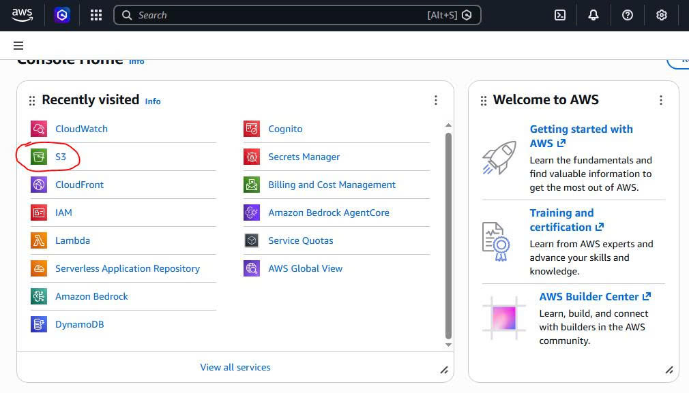

2. **Khởi tạo S3 Bucket:** Tại giao diện quản lý Buckets, nhấn nút **Create bucket**.
   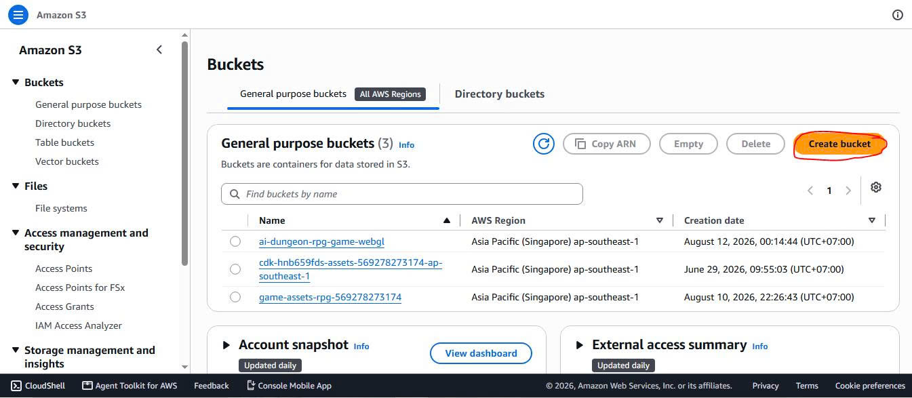

3. **Cấu hình tên Bucket:** Tại mục **Bucket name**, nhập tên định danh duy nhất cho Bucket (tên phải viết thường, không dấu, không chứa khoảng trắng hay ký tự đặc biệt, ví dụ: `ai-test-game`).
   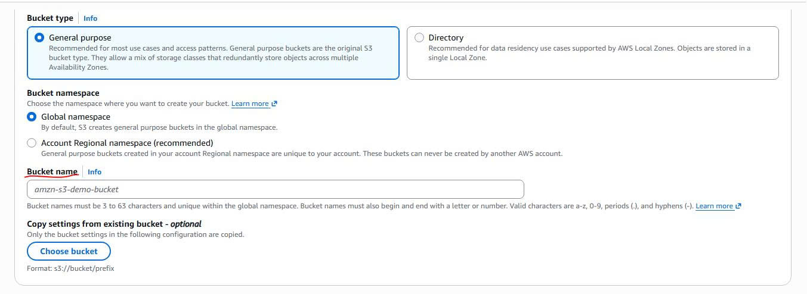

4. **Cấu hình quyền truy cập công khai (Public Access):**
   - Tại mục **Block Public Access settings for this bucket**, bỏ chọn ô **Block *all* public access** để cho phép người dùng truy cập trang web game.
   - Tick chọn ô xác nhận cảnh báo: *"I acknowledge that the current settings might result in this bucket and the objects within becoming public."*
   - Kéo xuống cuối trang và nhấn nút **Create bucket**.
   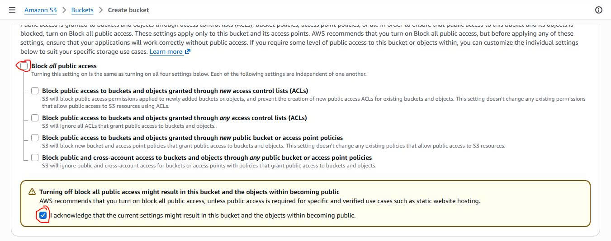

5. **Kích hoạt Static Website Hosting:**
   - Trong danh sách Buckets, nhấp chọn Bucket vừa tạo và chuyển sang tab **Properties**.
     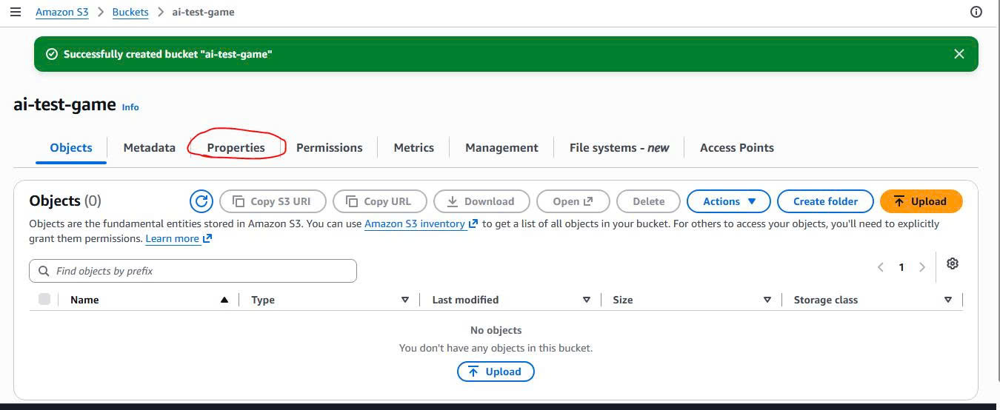
   - Cuộn xuống cuối trang tìm mục **Static website hosting**, chọn **Edit**.
     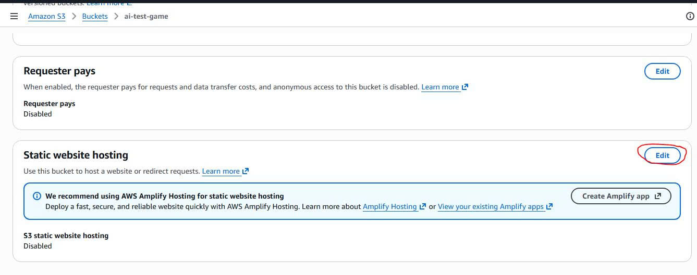
   - Chọn **Enable**.
   - Tại mục **Hosting type**, chọn **Host a static website**.
   - Tại ô **Index document**, nhập `index.html`.
   - Nhấn **Save changes** để hoàn tất.
     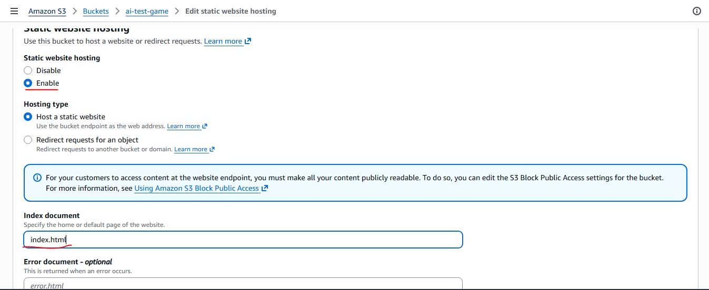

6. **Thiết lập Bucket Policy (Quyền đọc cho cộng đồng):**
   - Chuyển sang tab **Permissions**.
     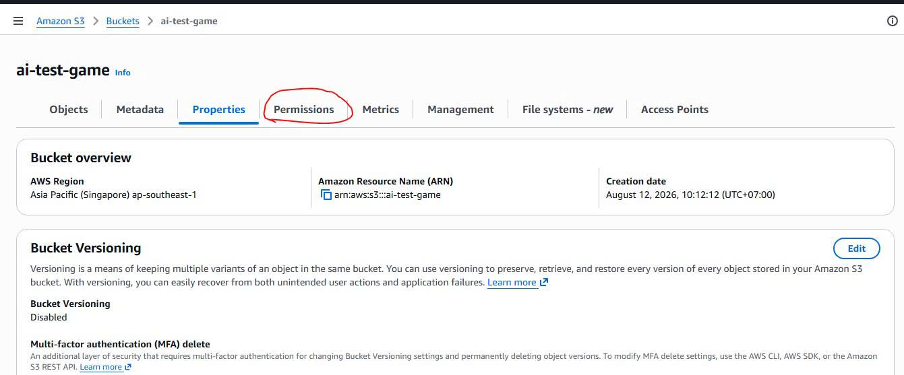
   - Tìm tới mục **Bucket policy** và nhấn nút **Edit**.
     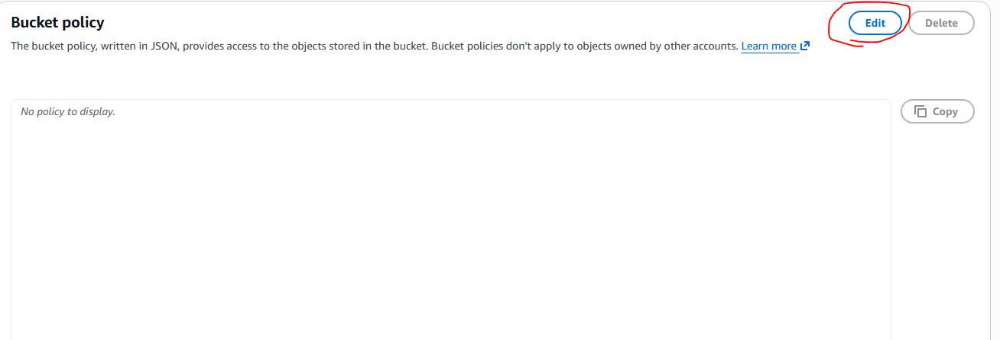
   - Sao chép và dán đoạn mã JSON Policy bên dưới vào khung biên soạn (thay thế `TÊN_BUCKET_CỦA_BẠN` bằng tên bucket của bạn ở bước 3):
     ```json
     {
         "Version": "2012-10-17",
         "Statement": [
             {
                 "Sid": "PublicReadGetObject",
                 "Effect": "Allow",
                 "Principal": "*",
                 "Action": "s3:GetObject",
                 "Resource": "arn:aws:s3:::TÊN_BUCKET_CỦA_BẠN/*"
             }
         ]
     }
     ```
   - Nhấn **Save changes**.
     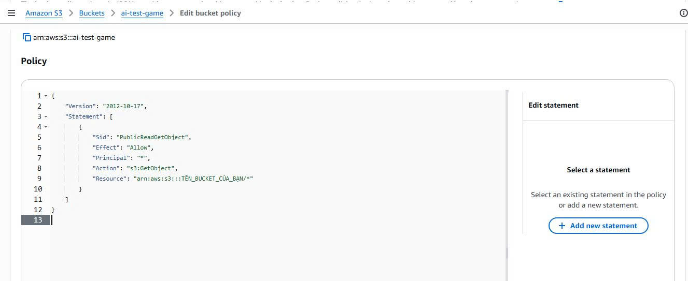

7. **Tải tệp WebGL lên S3:**
   - Sau khi lưu policy, kiểm tra mục **Block public access** hiển thị trạng thái `Off`. Chuyển sang tab **Objects**.
     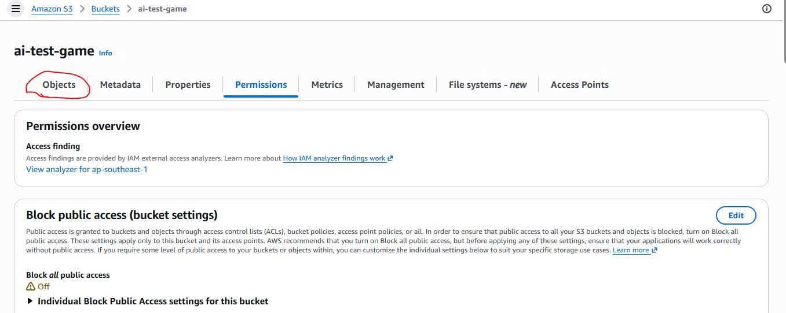
   - Nhấn nút **Upload** và tải toàn bộ các tệp/thư mục vừa build ở Giai đoạn 1 (`index.html`, thư mục `Build/`, thư mục `TemplateData/`) lên S3.
     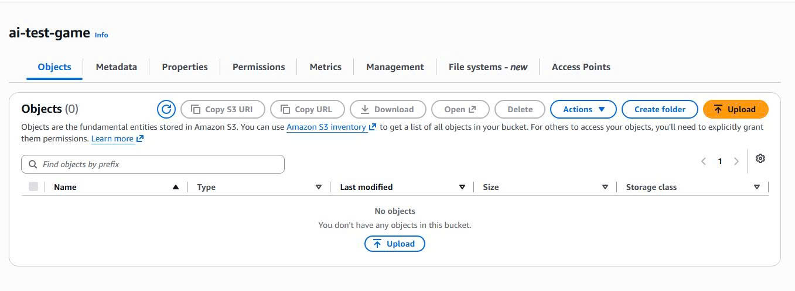

---

### Giai đoạn 3: Phân phối Game qua AWS CloudFront (HTTPS CDN)

Sử dụng mạng lưới giao nhận nội dung (CDN) AWS CloudFront giúp mã hóa đường truyền qua HTTPS và tối ưu tốc độ phản hồi cho người chơi toàn cầu.

1. **Truy cập dịch vụ CloudFront:** Trên trang chủ AWS Console, tìm kiếm và chọn dịch vụ **CloudFront**.
   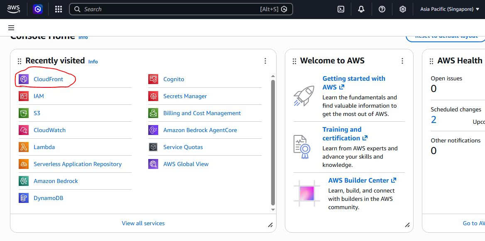

2. **Khởi tạo CloudFront Distribution:** Tại giao diện quản lý Distributions, chọn **Create distribution**.
   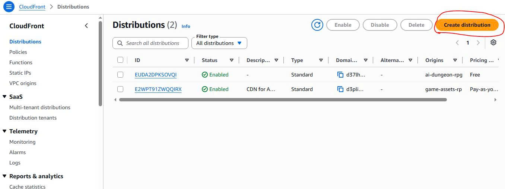

3. **Chọn Gói dịch vụ (Choose a plan):** Tại bước *Choose a plan*, chọn gói **Free ($0/month)** phục vụ mục đích học tập và thử nghiệm.
   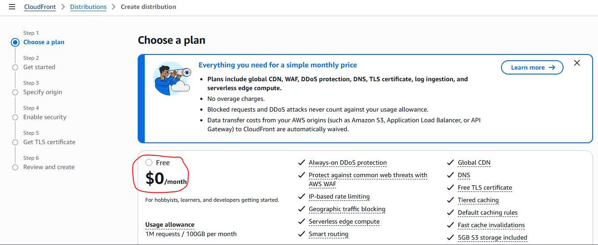

4. **Đặt tên Distribution (Get started):** Tại bước *Get started*, nhập tên gợi nhớ cho Distribution tại mục **Distribution name** (ví dụ: `AI-DUNGEON-RPG-GAME`).
   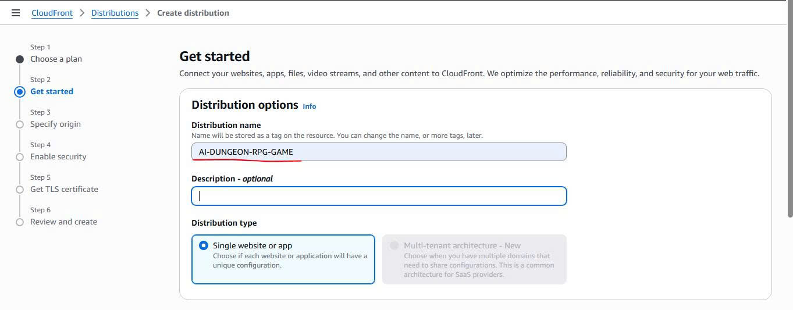

5. **Cấu hình loại nguồn (Specify origin):** Tại bước *Specify origin*, chọn loại **Amazon S3** trong danh sách **Origin type**.
   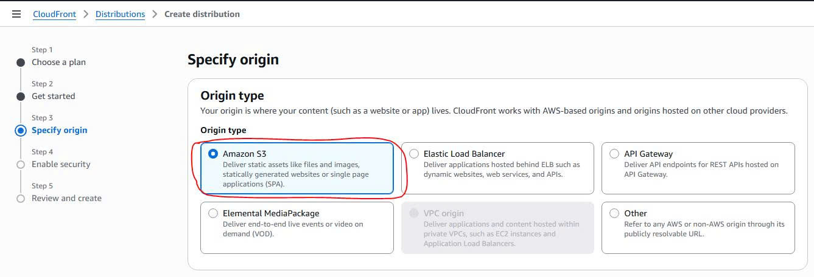

6. **Kết nối tới S3 Bucket:**
   - Nhấn vào nút **Browse S3** tại trường *S3 origin*.
     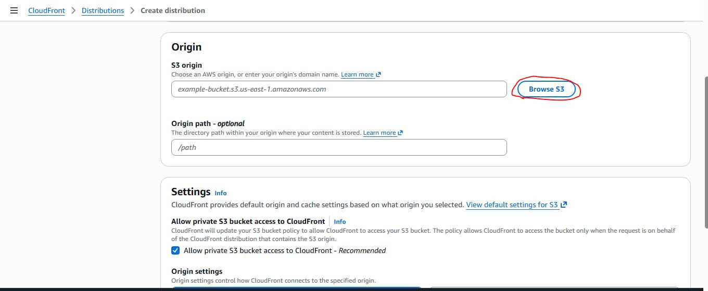
   - Trong cửa sổ hiển thị, chọn đúng S3 Bucket vừa tạo ở Giai đoạn 2 (ví dụ: `ai-dungeon-rpg-game-webgl`) và bấm **Choose**.
     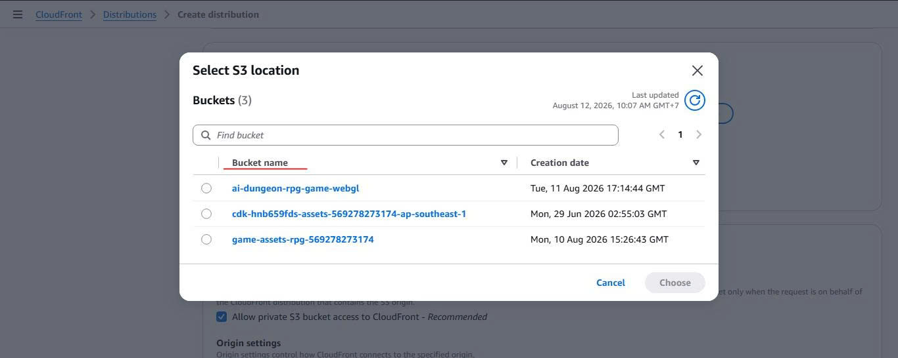

7. **Thiết lập ép buộc HTTPS & Kích hoạt:**
   - Kéo xuống mục **Default cache behavior** → **Viewer protocol policy**, tích chọn tùy chọn **Redirect HTTP to HTTPS** (để bảo mật kết nối và tự động chuyển hướng đường dẫn).
   - Kéo xuống cuối trang và chọn **Create distribution**.
   - Hệ thống sẽ mất khoảng **5 - 10 phút** để triển khai (Deploy) CDN trên toàn cầu. Khi cột **Status** chuyển sang trạng thái **Enabled**, sao chép đường dẫn ở cột **Distribution domain name** (có dạng `https://d1xxxxxxxxxxxx.cloudfront.net`).
   - Mở đường dẫn này trên trình duyệt web bất kỳ để chơi game!
