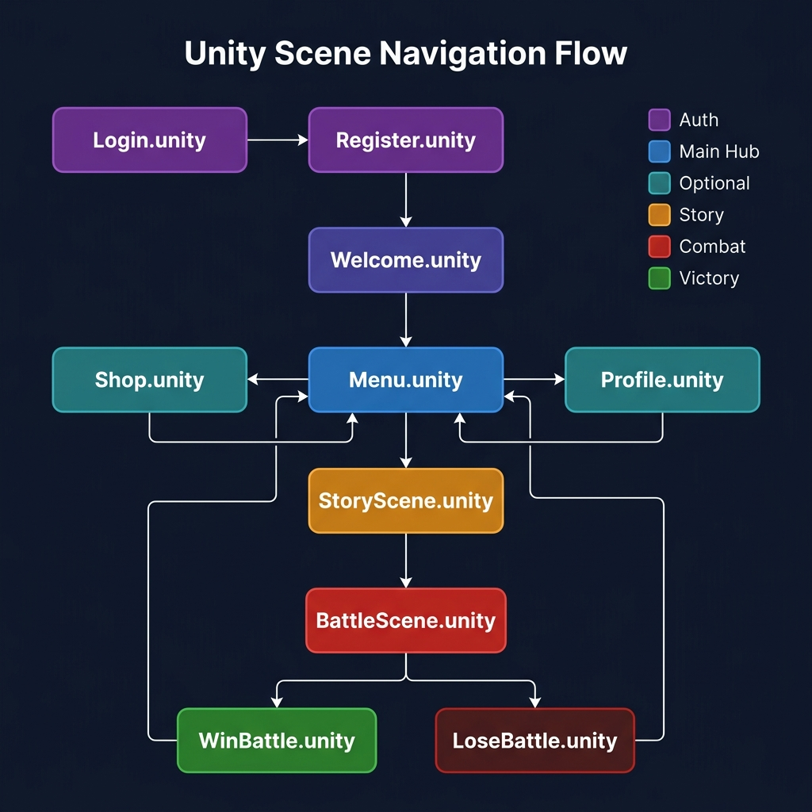

#### Simulating Complete Game Gameplay

Now that all isolated endpoints have been verified, you can test the full game loop end-to-end via the Unity 2D Client.

---

#### Game Flow Execution Diagram

```text
[1. Login] ──► [2. Create Character] ──► [3. Start AI Dungeon Story]
                                                  │
                                                  ▼
[5. Back to Menu] ◄── [4. Win Boss Battle & Loot] ◄───┘ (triggerBattle = true)
      │
      ├──► [Profile.unity]  — View character stats & equipment
      └──► [Shop.unity]     — Buy items with earned Gold
```

---

#### Unity Scene Navigation Flow



The game is organized into **10 Unity Scenes** with the following navigation flow:

| From Scene | Action | To Scene |
|---|---|---|
| `Login.unity` | Successful login | `Welcome.unity` |
| `Login.unity` | Click "Register" | `Register.unity` |
| `Register.unity` | Registration success | `Login.unity` |
| `Welcome.unity` | Auto-navigate | `Menu.unity` |
| `Menu.unity` | Click "Play" | `StoryScene.unity` |
| `Menu.unity` | Click "Profile" | `Profile.unity` |
| `Menu.unity` | Click "Shop" | `Shop.unity` |
| `StoryScene.unity` | Battle triggered | `BattleScene.unity` |
| `BattleScene.unity` | Player wins | `WinBattle.unity` |
| `BattleScene.unity` | Player loses | `LoseBattle.unity` |
| `WinBattle.unity` | Continue | `Menu.unity` |
| `LoseBattle.unity` | Retry | `Menu.unity` |

---

#### 1. Unity Client Integration Setup

1. Open **Unity Editor** and load the project from the repository root.

2. Open the **Menu Scene**: `Assets/Scenes/Menu.unity`.

3. In the **Project** panel, navigate to `Assets/Resources/` and select **`GameConfig.asset`**.

4. In the **Inspector** panel, populate your deployed endpoint details:

   | Field | Value |
   |---|---|
   | **Api Base Url** | `https://<api-id>.execute-api.ap-southeast-1.amazonaws.com/prod/` |
   | **Aws Cognito User Pool Id** | `ap-southeast-1_xxxxx` |
   | **Aws Cognito Client Id** | `<your-cognito-app-client-id>` |
   | **Aws Cognito Region** | `ap-southeast-1` |
   | **Use Mock Mode** | ☐ *Unchecked (OFF)* |
   | **Enable Api Logging** | ☑ *Checked (ON)* |

5. Press **Play** in Unity Editor, starting from `Login.unity`.

6. Register a new user → confirm via Cognito Console → log in → create a character → start playing the AI dungeon story!

---

#### 2. Verification Checkpoints

- **Latency Check:** AWS Bedrock dynamic text response should complete within ~1.5 - 3 seconds.
- **Server-Authoritative Combat:** Validate that health changes and loot items in Unity match the exact records stored in **Amazon DynamoDB** (check via DynamoDB Console).
- **Security Check:** Attempting requests without a valid JWT Token returns `401 Unauthorized`.
- **Mock Mode Test:** Set `Use Mock Mode = true` in `GameConfig.asset` and verify the game runs offline with pre-defined test data (`MockAuthService`).
- **Console Logs:** With `Enable Api Logging = true`, verify each API call appears in Unity Console:
  ```
  [ApiClient] → POST https://xxx.execute-api.ap-southeast-1.amazonaws.com/prod/story/start
  [ApiClient] → POST https://xxx.execute-api.ap-southeast-1.amazonaws.com/prod/battle/resolve
  ```